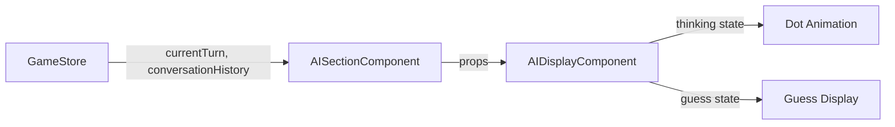

# AI Display Component Specification

## 1. Overview

Combine the existing `AIThinkingSection` and `AIGuessSection` components into a single unified `AIDisplayComponent` that handles both AI thinking states and AI guess display. The component will use the same dot animation pattern as the typing indicator (500ms intervals, immediate transitions) and maintain the existing visual styling.

**Key Features:**
- Single component for both AI thinking and AI guess states
- Animated dots during thinking phase (".", "..", "..." pattern)
- Immediate state transitions (no fade animations)
- Maintains existing holographic cyan styling
- Uses VT323 font family for consistency

## 2. Architecture Diagram



## 3. Configuration

```yaml
animation:
  dotInterval: 500
  dots: [".", "..", "..."]
  
styling:
  backgroundColor: "rgba(0,255,255,0.08)"
  borderColor: "#00FFF0"
  textColor: "#00FFF0"
  fontFamily: "VT323"
  shadowColor: "#00FFF0"
  
component:
  padding: 14
  borderRadius: 6
  borderWidth: 2
  shadowOpacity: 0.7
  shadowRadius: 16
  elevation: 8
```

## 4. API / Protocol

### Component Props Interface

```typescript
interface AIDisplayComponentProps {
  isThinking: boolean;
  thinkingText?: string;
  guess?: string;
}
```

### State Management

| State | Description | Display |
|-------|-------------|---------|
| `isThinking: true` | AI is analyzing conversation | "AI is thinking..." + animated dots |
| `isThinking: false` + `guess` | AI has made a guess | "AI Guess: [guess]" |
| `isThinking: false` + no `guess` | No AI activity | Hidden component |

### Animation States

| State | Text | Dots | Duration |
|-------|------|------|----------|
| 0 | "AI is thinking" | "" | 500ms |
| 1 | "AI is thinking" | "." | 500ms |
| 2 | "AI is thinking" | ".." | 500ms |
| 3 | "AI is thinking" | "..." | 500ms |

## 5. Phases & Tasks

### Phase 1: Component Creation
- [x] Create new `AIDisplayComponent.tsx` file
- [x] Implement basic component structure with props interface
- [x] Add state management for thinking/guess modes
- [x] Implement dot animation logic (500ms intervals)
- [x] Add immediate state transition handling
- [x] Implement conditional rendering logic
- [x] Add error handling for invalid props
- [x] Add component export

### Phase 2: Styling Implementation
- [x] Copy existing holographic cyan styling from current components
- [x] Implement container styles with border and shadow
- [x] Add text styling with VT323 font family
- [x] Implement dot animation styling
- [x] Add guess text styling (larger font size)
- [x] Ensure consistent spacing and padding
- [x] Add responsive layout handling
- [x] Test styling across different screen sizes

### Phase 3: Integration
- [x] Update `AISectionComponent.tsx` to use new component
- [x] Remove old `AIThinkingSection` and `AIGuessSection` imports
- [x] Update component props to pass correct data
- [x] Test integration with existing conversation flow
- [x] Verify animation timing matches typing indicator
- [x] Test state transitions between thinking and guess
- [x] Ensure no layout shifts during state changes
- [x] Validate WebSocket event handling

### Phase 4: Cleanup
- [x] Delete old `AIThinkingSection.tsx` file
- [x] Delete old `AIGuessSection.tsx` file
- [x] Remove unused styles from `AISectionComponent.tsx`
- [x] Clean up any dead code references
- [x] Update component documentation
- [x] Final testing of complete AI display flow

## 6. Testing Strategy

### Manual Testing Checklist
- [ ] AI thinking animation displays correctly
- [ ] Dots animate at 500ms intervals
- [ ] State transitions are immediate (no fade)
- [ ] AI guess displays with correct styling
- [ ] Component hides when no AI activity
- [ ] No layout shifts during state changes
- [ ] Styling matches existing holographic theme
- [ ] Works on both encoder and decoder screens

### Integration Testing
- [ ] WebSocket events trigger correct states
- [ ] Conversation history parsing works correctly
- [ ] Component integrates with game flow
- [ ] No memory leaks from animation intervals
- [ ] Performance impact is minimal

## 7. Monitoring & Metrics

### Performance Metrics
- Animation frame rate: 60fps
- State transition time: <16ms
- Memory usage: No increase from current components
- Bundle size: Reduced (removing 2 components)

### Error Monitoring
- Invalid props handling
- Animation cleanup on unmount
- WebSocket event parsing errors
- State transition edge cases

## 8. Deployment

### Implementation Steps
1. Create new component in `frontend/app/components/AIDisplayComponent.tsx`
2. Test component in isolation
3. Integrate with `AISectionComponent.tsx`
4. Delete old component files
5. Deploy to development environment
6. Test complete AI flow
7. Deploy to production

## 9. Success Criteria

### Functional Requirements
- [x] Component displays "AI is thinking..." with animated dots during AI turn
- [x] Dots animate in pattern: "", ".", "..", "..." every 500ms
- [x] Component displays "AI Guess: [word]" when guess is received
- [x] State transitions are immediate (no fade animations)
- [x] Component maintains existing holographic cyan styling
- [x] Component integrates seamlessly with existing game flow

### Technical Requirements
- [x] Single component replaces two existing components
- [x] Animation timing matches typing indicator (500ms intervals)
- [x] No memory leaks from animation intervals
- [x] Component properly cleans up on unmount
- [x] Bundle size is reduced or maintained

### User Experience Requirements
- [x] No visual glitches during state transitions
- [x] Animation feels smooth and responsive
- [x] Styling is consistent with existing UI
- [x] No layout shifts during component state changes
- [x] Clear visual distinction between thinking and guess states
