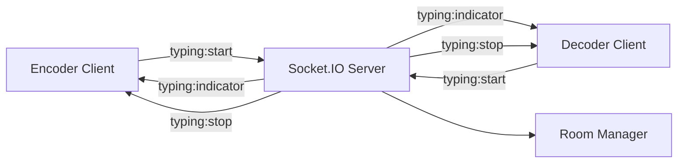

# Live Typing Indicators Specification

## 1. Overview

Implement real-time typing indicators for the Smuggler game chat system. When a user types in the chat input field, the other player in the room will see an animated message showing "[Role] is typing..." with animated dots. The indicator appears immediately when typing starts and disappears 1 second after the user stops typing.

**Key Features:**
- Real-time typing feedback between encoder/decoder pairs
- Animated dots cycle: "." → ".." → "..." → "."
- Automatic cleanup after 1 second of inactivity
- Integration with existing chat message list

## 2. Architecture Diagram



## 3. Configuration

```yaml
typing:
  timeout: 1000  # milliseconds before hiding indicator
  animation:
    interval: 500  # milliseconds between dot cycles
    dots: [".", "..", "..."]
  
socket:
  events:
    typingStart: "typing:start"
    typingStop: "typing:stop"
    typingIndicator: "typing:indicator"
```

## 4. API / Protocol

### Socket Events

| Event | Direction | Payload | Description |
|-------|-----------|---------|-------------|
| `typing:start` | Client → Server | `{ roomId: string, role: string }` | User started typing |
| `typing:stop` | Client → Server | `{ roomId: string, role: string }` | User stopped typing |
| `typing:indicator` | Server → Client | `{ role: string, isTyping: boolean }` | Typing status update |

### Event Flow
1. User types in chat input → `typing:start` event
2. Server broadcasts `typing:indicator` to other player in room
3. User stops typing → `typing:stop` event after 1 second timeout
4. Server broadcasts `typing:indicator` with `isTyping: false`

## 5. Phases & Tasks

### Phase 1: Backend Socket Event Handling
- [x] Add typing event handlers to socket handlers
- [x] Implement room-based typing state management
- [x] Create typing timeout cleanup mechanism
- [x] Add typing event broadcasting to room members
- [x] Integrate with existing room validation logic
- [x] Add typing state to room data structure
- [x] Implement typing event rate limiting (if needed)
- [x] Add typing event logging for debugging

### Phase 2: Frontend Typing Detection
- [ ] Add input event listeners to chat input field
- [ ] Implement typing start/stop detection logic
- [ ] Create typing timeout management on client
- [ ] Add typing state to game store
- [ ] Implement typing event emission to server
- [ ] Add typing indicator component to chat list
- [ ] Create animated dots component
- [ ] Integrate typing indicator with conversation history

### Phase 3: UI Integration & Animation
- [ ] Design typing indicator message styling
- [ ] Implement animated dots cycle animation
- [ ] Add typing indicator to conversation message list
- [ ] Create smooth show/hide transitions
- [ ] Ensure typing indicator doesn't interfere with scrolling
- [ ] Add role-based message formatting ("Encoder is typing...")
- [ ] Test typing indicator with different message lengths
- [ ] Optimize animation performance

### Phase 4: Testing & Edge Cases
- [ ] Test typing indicators with network disconnections
- [ ] Verify typing state cleanup on room leave
- [ ] Test multiple rapid typing start/stop events
- [ ] Validate typing indicators during game state changes
- [ ] Test typing indicators with different room configurations
- [ ] Add unit tests for typing event handlers
- [ ] Add integration tests for typing indicator flow
- [ ] Performance testing with concurrent typing events

## 6. Testing Strategy

### Unit Tests
- Typing event emission and handling
- Typing timeout cleanup logic
- Room-based typing state management
- Animated dots component rendering

### Integration Tests
- End-to-end typing indicator flow
- Socket event broadcasting accuracy
- Typing state synchronization between clients

### Manual Testing
- Typing indicator visibility and timing
- Animation smoothness and performance
- Edge cases with network issues
- UI integration with existing chat

## 7. Monitoring & Metrics

### Key Metrics
- Typing event frequency per room
- Typing indicator display duration
- Socket event latency for typing indicators
- Animation frame rate performance

### Logging
- Typing start/stop events with room and role
- Typing timeout cleanup events
- Socket event broadcast success/failure

## 8. Deployment

### Backend Changes
- Deploy socket event handlers
- Update room management logic
- Add typing state persistence (if needed)

### Frontend Changes
- Deploy typing detection logic
- Update chat UI components
- Add animated typing indicator

### Rollback Plan
- Disable typing events via feature flag
- Remove typing indicator from UI
- Revert socket event handlers

## 9. Success Criteria

### Functional Requirements
- [ ] Typing indicator appears immediately when user starts typing
- [ ] Animated dots cycle correctly: "." → ".." → "..."
- [ ] Typing indicator disappears 1 second after user stops typing
- [ ] Only shows typing indicator for the other player in the room
- [ ] Typing indicator displays correct role ("Encoder is typing..." or "Decoder is typing...")
- [ ] Typing indicator appears in chat message list as a message

### Performance Requirements
- [ ] Typing events don't impact game performance
- [ ] Animation runs smoothly at 60fps
- [ ] Socket events have <100ms latency
- [ ] No memory leaks from typing state management

### User Experience
- [ ] Typing indicator feels responsive and natural
- [ ] Animation is visually appealing and not distracting
- [ ] Typing indicator doesn't interfere with chat scrolling
- [ ] Clear visual distinction between typing indicator and regular messages
