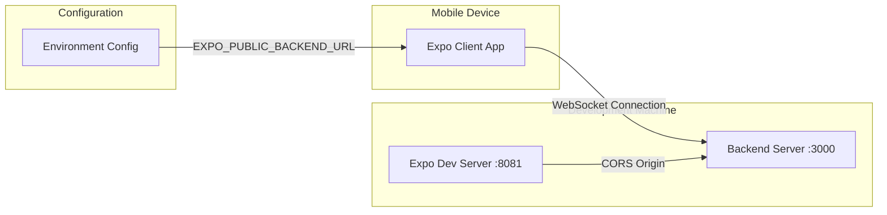

# Mobile Development Environment Configuration Specification

## 1. Overview

This specification addresses the mobile development connectivity issue where React Native/Expo apps cannot access backend servers running on `localhost:3000` from physical devices. The solution provides a configurable IP-based connection system that supports both local and remote development scenarios.

### Problem Statement
- Backend server runs on `localhost:3000` (development machine)
- Mobile devices (phones/tablets) cannot access `localhost` on development machine
- Multiple developers need individual configuration for their environments
- CORS and WebSocket connections must adapt to different IP addresses

### Solution Overview
- Environment-based IP configuration for backend URL
- Automatic CORS adaptation based on configured IP
- Simple, minimal implementation without unnecessary complexity

## 2. Architecture Diagram



## 3. Configuration

### Environment Variables

| Variable | Type | Default | Description |
|----------|------|---------|-------------|
| `EXPO_PUBLIC_BACKEND_URL` | string | `http://localhost:3000` | Backend server URL for mobile app |
| `BACKEND_CORS_ORIGIN` | string | `http://localhost:8081` | CORS origin for Expo dev server |
| `BACKEND_PORT` | integer | `3000` | Backend server port |

### Configuration Files

**Frontend `.env` (per developer):**
```yaml
# Mobile app backend connection
EXPO_PUBLIC_BACKEND_URL=http://192.168.1.100:3000

# Optional: Override Expo dev server port
EXPO_PUBLIC_EXPO_PORT=8081
```

**Backend `.env` (per developer):**
```yaml
# Server configuration
PORT=3000
NODE_ENV=development

# CORS configuration (auto-detected from EXPO_PUBLIC_BACKEND_URL)
BACKEND_CORS_ORIGIN=http://192.168.1.100:8081
```

## 4. API / Protocol

### Connection Endpoints

| Endpoint | Method | Purpose | Response |
|----------|--------|---------|----------|
| `/api/health` | GET | Basic health check | `{ status: "ok", timestamp: string }` |

### WebSocket Events

*No additional events needed - existing WebSocket connection events provide sufficient feedback*

### Error Handling

| Error Type | HTTP Status | Response | Mobile App Action |
|------------|-------------|----------|-------------------|
| Connection Refused | N/A | WebSocket error | Show connection error screen |
| CORS Error | 403 | CORS policy violation | Log error, suggest IP check |
| Timeout | N/A | Connection timeout | Retry with exponential backoff |

## 5. Phases & Tasks

### Phase 1: Environment Configuration Setup ✅ COMPLETED
- [x] Create `.env.example` files for both frontend and backend
- [x] Update backend CORS configuration to use environment variable
- [x] Modify frontend WebSocket service to use `EXPO_PUBLIC_BACKEND_URL`
- [x] Add connection validation endpoint to backend
- [x] Update backend server startup to log configured URLs
- [x] Add IP address detection utility for developers
- [x] Create environment validation script
- [x] Update `.gitignore` to exclude individual `.env` files

**Implementation Notes:**
- Kept implementation minimal and simple
- Backend CORS now uses `BACKEND_CORS_ORIGIN` environment variable
- Frontend WebSocket already uses `EXPO_PUBLIC_BACKEND_URL` environment variable
- Health endpoint shows configured URLs for debugging
- Server startup logs show mobile connection URL
- Simple environment variable test created

### Phase 2: Error Handling & User Experience
- [x] Create clear connection error UI components
- [x] Add helpful error messages for common issues (wrong IP, server down)
- [x] Implement simple retry button for connection failures
- [x] Add connection status indicators in mobile app
- [x] Create connection troubleshooting guide
- [x] Add helpful console logging for debugging
- [x] Implement graceful error display without blocking app
- [x] Add "Check Connection" button in settings/error screens
- [x] **Debug and resolve TransportError: 'Failed to connect to /192.168.1.248:3000' (see Section 10 for troubleshooting steps)**

### Phase 3: Developer Experience & Documentation
- [ ] Create setup guide in README.md
- [ ] Add IP address discovery script
- [ ] Create environment configuration wizard
- [ ] Add connection testing commands to package.json
- [ ] Document troubleshooting steps
- [ ] Create development environment checklist
- [ ] Add environment validation to CI/CD pipeline
- [ ] Create developer onboarding documentation

## 6. Testing Strategy

### Unit Tests
- [ ] Environment variable parsing and validation
- [ ] CORS configuration adaptation
- [ ] Connection URL construction
- [ ] Error handling and retry logic

### Integration Tests
- [ ] End-to-end connection from mobile app to backend
- [ ] CORS policy enforcement with different IP addresses
- [ ] WebSocket connection establishment
- [ ] Error handling for connection failures

### Manual Testing Checklist
- [ ] Local development machine connection
- [ ] Remote developer connection (different network)
- [ ] Connection with different IP addresses
- [ ] Error scenarios (wrong IP, server down, network issues)
- [ ] Multiple developers testing simultaneously

## 7. Monitoring & Metrics

### Connection Metrics
- [ ] Connection success/failure rates
- [ ] Connection latency measurements
- [ ] WebSocket connection stability
- [ ] Environment configuration usage

### Error Tracking
- [ ] Connection error types and frequencies
- [ ] CORS violation tracking
- [ ] Timeout and retry statistics
- [ ] Developer environment issues

### Health Monitoring
- [ ] Backend server availability
- [ ] Mobile app connection status
- [ ] Environment configuration validation
- [ ] Development environment health checks

## 8. Deployment

### Development Environment Setup
1. **IP Address Discovery**: Developers run `npm run discover-ip` to get their local IP
2. **Environment Configuration**: Copy `.env.example` to `.env` and update with local IP
3. **App Startup**: Mobile app attempts connection and shows errors if needed

### Configuration Validation
- [ ] Environment variable presence and format validation
- [ ] Basic CORS configuration verification

### Rollback Strategy
- [ ] Fallback to localhost if environment variable missing
- [ ] Graceful degradation for connection failures
- [ ] Clear error messages for configuration issues
- [ ] Quick setup guide for new developers

## 9. Success Criteria

### Connection Success
- [ ] Mobile app successfully connects to backend using configured IP
- [ ] WebSocket connections establish without CORS errors
- [ ] Connection validation endpoints respond correctly
- [ ] Multiple developers can connect simultaneously

### Developer Experience
- [ ] New developers can set up environment in <5 minutes
- [ ] Connection issues are clearly identified and resolved
- [ ] Environment configuration is documented and easy to follow
- [ ] Setup process is automated where possible

### Error Handling
- [ ] Connection failures show clear error messages
- [ ] Retry logic prevents unnecessary connection attempts
- [ ] Fallback mechanisms work when primary connection fails
- [ ] Troubleshooting guide resolves common issues

### Performance
- [ ] Connection establishment time <2 seconds
- [ ] WebSocket connection stability >99%
- [ ] Environment validation completes in <1 second
- [ ] No performance impact on existing functionality

## 10. Real-World Mobile Connection Challenges

### Example Error (from Android Expo Go)

```
[WebSocket] Full error object: {
  "description": {
    "isTrusted": false,
    "message": "Failed to connect to /192.168.1.248:3000"
  },
  "type": "TransportError"
}
```

#### Call Stack (abbreviated)
- _construct
- Wrapper
- _callSuper
- SyntheticError
- reactConsoleErrorHandler
- anonymous

### What This Means
- The mobile device attempted to connect to the backend at the correct IP and port, but the connection failed at the network level.
- This is a **TransportError**: the device could not reach the server at all (not a CORS or code bug).

### Common Causes
- Backend server is not running or not listening on the correct IP/port
- Firewall on the development machine is blocking incoming connections
- Mobile device is not on the same WiFi network as the development machine
- The IP address in `.env` is incorrect or has changed (e.g., after reconnecting to WiFi)
- VPNs or network isolation features are interfering

### Troubleshooting Steps
1. **Verify Backend is Running**: Ensure `npm run dev:backend` is active and listening on the correct port.
2. **Check IP Address**: Double-check your local IP with `ifconfig`/`ipconfig` and update `.env` if needed.
3. **Firewall Settings**: Temporarily disable your firewall or allow incoming connections on port 3000.
4. **Same Network**: Make sure both your computer and phone are on the same WiFi network (not guest or isolated networks).
5. **Test with Browser**: On your phone, open a browser and try to visit `http://192.168.1.248:3000/api/health`.
   - If it doesn't load, the issue is network/firewall, not your code.
6. **Restart Everything**: Restart backend, frontend, and Expo Go app after any changes.

### Note
Even with correct environment variables and CORS, real-world network issues can block mobile connections. Always test connectivity from the device itself, not just from your computer.

#### UI/UX Note
- Connection test results are now shown inline in the error and troubleshooting screens, instead of using pop-up alerts. This improves reliability and testability.
