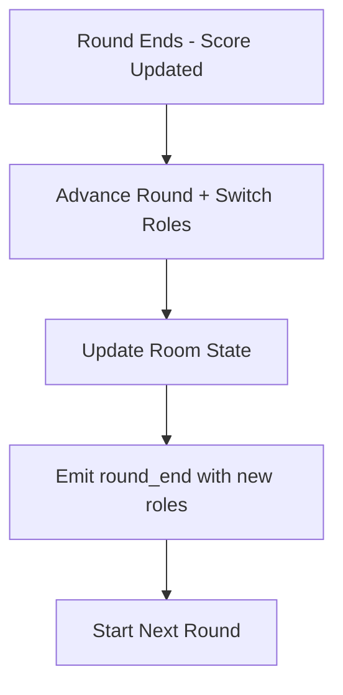

# Role Switching Implementation Checklist

## Overview
This specification addresses the implementation of role switching between players after each round. Currently, players keep their assigned roles (Encryptor/Decryptor) throughout the entire game. The new feature will swap roles after every round, regardless of whether the AI or humans score.

### Problem Statement
- Players are assigned fixed roles at game start (first player = Encryptor, second = Decryptor)
- Roles remain static throughout all rounds of the game
- Players don't get to experience both sides of the game in a single session
- Game becomes predictable and less engaging over multiple rounds

### Solution Overview
- Implement automatic role switching after each round completion
- Update backend game logic to handle role changes seamlessly
- Include role information in existing `round_end` event
- Minimal frontend changes - focus on backend logic only

## 2. Architecture Diagram



## 3. Implementation Phases

### Phase 1: Backend Role Switching Logic
- [ ] **Update `advanceRound` method signature**
  - [ ] Modify `GameStateManager.advanceRound()` to accept and return roles
  - [ ] Change signature from `advanceRound(gameState)` to `advanceRound(gameState, roles)`
  - [ ] Return both new game state and new roles
  - [ ] Add role switching logic using existing `switchRoles` method

- [ ] **Update game handlers to use new advanceRound signature**
  - [ ] Modify `handlePlayerGuess` to pass roles to `advanceRound`
  - [ ] Modify `handleAIResponse` to pass roles to `advanceRound`
  - [ ] Update room state with new roles after round advancement
  - [ ] Include new roles in `round_end` event data

- [ ] **Update room state management**
  - [ ] Store current roles at room level
  - [ ] Update player objects with new roles after switching
  - [ ] Ensure role consistency across all game operations

### Phase 2: Frontend Minimal Updates
- [ ] **Update WebSocket event handling**
  - [ ] Modify `round_end` event handler to process role changes
  - [ ] Update player role in game store when roles change
  - [ ] No UI changes - just state management updates

- [ ] **Update game store**
  - [ ] Ensure `setPlayerRole` is called when roles change
  - [ ] No new UI state or notifications needed

### Phase 3: Testing & Validation
- [ ] **Unit tests for role switching**
  - [ ] Test updated `advanceRound` method with role switching
  - [ ] Test role switching in game handlers
  - [ ] Test role validation after switching

- [ ] **Integration tests**
  - [ ] End-to-end role switching in complete games
  - [ ] Test role switching with AI wins
  - [ ] Test role switching with human wins
  - [ ] Test role switching across multiple rounds

## 4. Technical Implementation Details

### Backend Changes Required

#### GameStateManager Updates
```typescript
// Current signature
public advanceRound(gameState: GameState): GameState

// New signature
public advanceRound(gameState: GameState, roles: RoleAssignment): {
    newGameState: GameState;
    newRoles: RoleAssignment;
} {
    const newRoles = this.switchRoles([], roles);
    const newGameState = {
        ...gameState,
        currentRound: gameState.currentRound + 1,
        conversationHistory: [],
        currentTurn: 'encryptor'
    };
    
    return { newGameState, newRoles };
}
```

#### Game Handlers Updates
```typescript
// In handlePlayerGuess and handleAIResponse
if (isCorrect) {
    // Update score and advance round with role switching
    const scoreUpdated = this.gameStateManager.updateScore(gameState, true);
    const { newGameState, newRoles } = this.gameStateManager.advanceRound(scoreUpdated, roles);
    
    // Update player roles in room
    room.players.forEach(player => {
        if (newRoles.encryptor === player.id) {
            player.role = 'encryptor';
        } else if (newRoles.decryptor === player.id) {
            player.role = 'decryptor';
        }
    });
    
    // Update room state
    room.gameState = newGameState;
    
    // Emit round_end with new roles included
    const roundEndData = {
        roomId,
        correct: isCorrect,
        score: newGameState.score,
        gameEnded: false,
        newSecretWord: newGameState.secretWord,
        currentTurn: newGameState.currentTurn,
        roles: newRoles // Include new roles in round_end event
    };
    
    socket.to(roomId).emit('round_end', roundEndData);
    socket.emit('round_end', roundEndData);
}
```

#### Room State Management
```typescript
// Add roles to room interface
interface Room {
    id: string;
    players: Player[];
    gameState: GameState | null;
    roles: RoleAssignment | null; // Add this
    createdAt: Date;
    lastActivity: Date;
}

// Update room creation to include roles
public createRoom(): Room {
    return {
        id: generateRoomId(),
        players: [],
        gameState: null,
        roles: null, // Will be set when game starts
        createdAt: new Date(),
        lastActivity: new Date()
    };
}
```

### Frontend Changes Required

#### WebSocket Event Handler (Minimal)
```typescript
// Update existing round_end handler
socket.on('round_end', (data: any) => {
    console.log('[WebSocket] Round end:', data);
    
    // Clear conversation history for new round
    useGameStore.getState().setConversationHistory([]);
    
    useGameStore.getState().setRound(data.round || 1);
    if (data.score !== undefined) {
        useGameStore.getState().setScore(data.score);
    }
    if (data.currentTurn) {
        useGameStore.getState().setCurrentTurn(data.currentTurn);
    }
    if (data.newSecretWord) {
        useGameStore.getState().setSecretWord(data.newSecretWord);
    }
    
    // Handle role changes if included
    if (data.roles) {
        const currentPlayer = useGameStore.getState().player;
        if (currentPlayer) {
            const newRole = data.roles.encryptor === currentPlayer.id ? 'encryptor' : 'decryptor';
            useGameStore.getState().setPlayerRole(newRole);
        }
    }
});
```

## 5. Testing Strategy

### Unit Tests
- [ ] Test updated `advanceRound` method with role switching
- [ ] Test role switching logic in game handlers
- [ ] Test role assignment validation
- [ ] Test round advancement with role switching

### Integration Tests
- [ ] Complete game flow with role switching
- [ ] Multiple rounds with role changes
- [ ] AI wins with role switching
- [ ] Human wins with role switching
- [ ] Player disconnection during role switching

### Manual Testing Checklist
- [ ] Start new game and play through multiple rounds
- [ ] Verify roles switch after each round
- [ ] Test role switching with AI wins
- [ ] Test role switching with human wins
- [ ] Test player disconnection during role switching
- [ ] Test game end during role switching

## 6. Success Criteria

### Functional Requirements
- [ ] Roles switch automatically after each round
- [ ] Role switching works for both AI and human wins
- [ ] Game state remains consistent during role switching
- [ ] Role switching works across multiple rounds
- [ ] No race conditions or state inconsistencies

### Technical Requirements
- [ ] Role switching is atomic and consistent
- [ ] No performance impact on existing functionality
- [ ] Minimal frontend changes required
- [ ] Backend logic handles all role switching
- [ ] Existing game flow remains unchanged

## 7. Implementation Notes

### Key Design Decisions
1. **Role switching happens at round end** - not as separate event
2. **Include roles in round_end event** - no new WebSocket events needed
3. **Minimal frontend changes** - focus on backend logic
4. **No UI transitions** - seamless role switching
5. **No backward compatibility** - clean implementation

### Files to Modify
- `backend/src/game/state.ts` - Update `advanceRound` method
- `backend/src/socket/handlers/gameHandlers.ts` - Update game handlers
- `backend/src/rooms/manager.ts` - Add roles to room state
- `frontend/services/websocket.ts` - Update `round_end` handler
- `backend/src/types/index.ts` - Update Room interface

### Files to Test
- `backend/tests/gameState.test.ts` - Test role switching logic
- `backend/tests/gameHandlers.test.ts` - Test game handlers
- `frontend/test/websocketHandling.test.ts` - Test WebSocket events

## 8. Rollback Strategy

### If Issues Arise
- [ ] Revert `advanceRound` method signature change
- [ ] Remove role switching from game handlers
- [ ] Remove roles from `round_end` event
- [ ] Restore original game flow

### Quick Fixes
- [ ] Disable role switching with feature flag
- [ ] Fallback to original role assignment
- [ ] Maintain game state consistency
- [ ] Clear error logging for debugging
