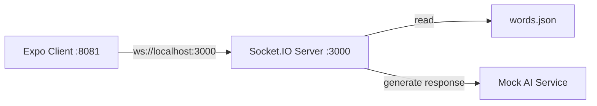

# Smuggler Game Backend Server Specification

## 1. Overview

Real-time WebSocket server for the Smuggler game, handling room management, game state, AI integration, and player communication. The server manages 2-player rooms where players have fixed roles as Encryptor/Decryptor, with an AI eavesdropper attempting to decode secret messages.

**Key Features:**
- WebSocket-based real-time communication via Socket.IO
- Room management with automatic cleanup
- Game state management (score, roles, conversation history)
- Mock AI integration with structured responses
- Word selection from static JSON file
- Player ready system and role assignment
- Comprehensive test suite with 231 passing tests

## 2. Architecture Diagram



## 3. Configuration

```yaml
server:
  port: 3000
  cors:
    origin: http://localhost:8081
    credentials: true

game:
  maxPlayersPerRoom: 2
  scoreRange: [0, 10]
  initialScore: 5
  winScore: 10
  loseScore: 0
  guessValidation:
    maxLevenshteinDistance: 2
    caseInsensitive: true
    trimWhitespace: true

ai:
  mockEnabled: true
  responseDelay: 500-2000ms
  thinkingSentences: 4
  maxWordsPerSentence: 12
  maxGuessLength: 12

logging:
  level: info
  format: simple
```

**Environment Variables:**
| Name                     | Type    | Default     | Description                                       |
|--------------------------|---------|-------------|---------------------------------------------------|
| PORT                     | integer | 3000        | Server port                                       |
| NODE_ENV                 | string  | development | Environment mode                                  |
| MAX_LEVENSHTEIN_DISTANCE | integer | 2           | Maximum Levenshtein distance for guess validation |

## 4. API / Protocol

### Socket.IO Events

| Event                     | Direction       | Payload                                                                     | Description                          |
|---------------------------|-----------------|-----------------------------------------------------------------------------|--------------------------------------|
| `join_room`               | Client → Server | `{ roomId: string }`                                                        | Join existing room or create new one |
| `player_ready`            | Client → Server | `{ roomId: string }`                                                        | Player marks themselves as ready     |
| `start_game`              | Server → Client | `{ roomId: string, players: Player[], roles: RoleAssignment }`              | Game starts when both players ready  |
| `send_message`            | Client → Server | `{ roomId: string, message: string, senderId: string }`                     | Encryptor sends message              |
| `ai_response`             | Server → Client | `{ roomId: string, message: Message }` | AI response added to conversation history |
| `player_guess`            | Client → Server | `{ roomId: string, guess: string, playerId: string }`                       | Decryptor attempts to guess secret   |
| `guess_result`            | Server → Client | `{ roomId: string, correct: boolean, winner: string, score: number }`       | Guess validation result              |
| `round_end`               | Server → Client | `{ roomId: string, score: number, gameEnded: boolean, winner: string }`     | Round completion and score update    |
| `game_end`                | Server → Client | `{ roomId: string, winner: string, finalScore: number }`                    | Game completion                      |
| `list_rooms`              | Client → Server | -                                                                           | Request current room list (legacy)   |
| `room_list`               | Server → Client | `{ rooms: Room[] }`                                                         | Broadcast room list to lobby clients |
| `check_room_availability` | Client → Server | `{ roomId: string }`                                                        | Check if room exists and has space   |

### HTTP API Endpoints

| Endpoint                | Method | Description                                   |
|-------------------------|--------|-----------------------------------------------|
| `GET /`                 | GET    | API status and welcome message                |
| `GET /api/health`       | GET    | Health check with uptime and environment info |
| `GET /api/ai/health`    | GET    | AI service health status                      |
| `POST /api/ai/response` | POST   | Generate AI response (mock implementation)    |
| `POST /api/rooms`       | POST   | Create new room and auto-join creator         |

### Data Structures

```typescript
interface Player {
  id: string;
  name: string;
  ready: boolean;
  role: 'encryptor' | 'decryptor' | null;
}

interface Room {
  id: string;
  players: Player[];
  gameState: GameState | null;
  createdAt: Date;
}

interface GameState {
  score: number;
  currentRound: number;
  secretWord: string;
  conversationHistory: Message[];  // Single unified array - includes all messages and AI responses
  currentTurn: 'encryptor' | 'ai' | 'decryptor';
  gameStatus: 'waiting' | 'active' | 'ended';
}

interface Message {
  id: string;
  content: string;
  senderId: string;
  timestamp: Date;
  role: 'encryptor' | 'decryptor' | 'ai';
  turnNumber: number;            // Sequential starting from 1
  
  // Optional fields for specific message types
  thinking?: string[];           // For AI messages (always present for AI)
}

interface OpenAIContext {
  gameId: string;                // Room/session identifier
  conversationHistory: Message[];
}

interface RoleAssignment {
  encryptor: string;
  decryptor: string;
}
```

## 5. Game Rules & Implementation

### Scoring System
- **Initial Score:** 5 (neutral starting point)
- **Score Range:** 0-10
- **Win Condition:** Score reaches 10 (players win)
- **Lose Condition:** Score reaches 0 (AI wins)
- **Score Changes:** +1 when players win round, -1 when AI wins round

### Turn Order
1. **Encryptor** sends message
2. **AI** analyzes and makes guess
3. **Decryptor** sends message/guess (if correct → round ends, if incorrect → added to conversation)
4. **AI** analyzes again and makes another guess
5. Repeat until someone guesses correctly

### Decryptor Message Handling
The decryptor's input serves **two purposes simultaneously**:
- **Message**: If the input doesn't match the secret word, it's added to `conversationHistory` as a response message
- **Guess**: If the input matches the secret word, the decryptor wins the round

**Flow Example:**
1. Encryptor: "I'm thinking of something round and red" → `conversationHistory` (role: 'encryptor')
2. AI: "apple" → `conversationHistory` (role: 'ai' with thinking)
3. Decryptor: "Is it something you eat?" → **CHECK AS GUESS** → incorrect → `conversationHistory` (role: 'decryptor')
4. AI: "tomato" → `conversationHistory` (role: 'ai' with thinking)
5. Decryptor: "apple" → **CORRECT GUESS** → round ends, players win

**Implementation Requirements:**
- All decryptor inputs are checked as guesses first
- If decryptor input is correct: round ends, players win
- If decryptor input is incorrect: add to `conversationHistory` as decryptor_message, continue conversation
- AI responses must be added to `conversationHistory` as ai_message with thinking field
- AI must analyze the full conversation including decryptor responses
- Only correct word matches should trigger round end
- **OpenAI Context**: Transform conversation history to simplified format for AI analysis
- **Turn Tracking**: Maintain sequential turn numbers for OpenAI context
- **Turn Order Validation**: Ensure strict outsider → ai → insider → ai → outsider sequence

### Role Assignment
- **First player to join** (room creator) → **Encryptor** (fixed role)
- **Second player to join** → **Decryptor** (fixed role)
- **Roles are fixed and do not switch** between rounds
- Each player maintains their assigned role throughout the entire game
- Role assignment happens once at game start and remains constant

### Guess Validation
- **Case Insensitive:** "Apple" matches "apple"
- **Trim Whitespace:** " apple " matches "apple"
- **Fuzzy Matching:** Levenshtein distance with configurable threshold (default: 2)
- **Examples:** "appel" matches "apple" (distance 1), "bananna" matches "banana" (distance 1)

## 6. AI Implementation

### Mock AI Service
- **Thinking Process:** 4 sentences, max 12 words each
- **Guess Generation:** Single word, max 12 characters
- **Response Delay:** 500-2000ms simulation
- **Semantic Analysis:** Basic word association matching
- **Fallback Logic:** Random word selection if analysis fails

### AI Response Structure
```typescript
interface AIResponse {
  thinking: string[]; // Exactly 4 sentences
  guess: string;      // Single word
}

// AI responses are integrated into conversation history as Message objects
// with role: 'ai' and thinking field
```

### Unified Message Structure

All conversation history uses a single `Message` type with optional fields for different message types:

**Message Types:**
1. **Encryptor Messages** (`role: 'encryptor'`)
   - `content`: The hint message
   - `role`: 'encryptor'

2. **Decryptor Messages** (`role: 'decryptor'`)
   - `content`: The response message (checked as guess, if incorrect becomes conversation)
   - `role`: 'decryptor'

3. **AI Messages** (`role: 'ai'`)
   - `content`: The AI's response (thinking process or final guess)
   - `role`: 'ai'
   - `thinking`: Array of individual thinking steps (always present for AI messages)

### OpenAI Context System

For AI analysis, our `Message` interface serves as the shared type for all conversation history:

**Message Types:**
1. **Encryptor Messages** (`role: 'encryptor'`)
   - `content`: The hint message
   - `turnNumber`: Sequential turn number

2. **AI Messages** (`role: 'ai'`)
   - `content`: The AI's guess
   - `thinking`: Array of 4 thinking sentences
   - `turnNumber`: Sequential turn number

3. **Decryptor Messages** (`role: 'decryptor'`)
   - `content`: The failed guess word
   - `turnNumber`: Sequential turn number

**Key Requirements:**
- Turn numbers must be sequential starting from 1
- Strict turn order: encryptor → ai → decryptor → ai → encryptor...
- Failed guesses only (successful guesses end game)
- Word validation (3-12 chars, lowercase) handled on frontend

**Benefits:**
- Single source of truth for all conversation history
- AI responses treated as regular messages in the conversation
- Easy chronological display of all interactions
- Simplified state management - no separate AI guesses array
- Consistent data structure for all message types

### Available Words
37 curated words including: Elephant, Pizza, Sunshine, Mountain, Ocean, Butterfly, Chocolate, Rainbow, Forest, Castle, Dragon, Guitar, Diamond, Volcano, Telescope, Waterfall, Fireworks, Treasure, Pirate, Wizard, Computer, Library, Hospital, Airport, Restaurant, School, Museum, Theater, Stadium, Bridge, Tower, Temple, Palace, Cottage, Lighthouse, Windmill, Fountain

## 7. Core Components

### Room Management
The `RoomManager` class handles:
- Room creation and joining
- Player tracking and disconnection handling
- Room cleanup for empty rooms
- Room availability checking
- Room listing functionality
- HTTP room creation with auto-join
- Lobby client tracking and room list broadcasting

### Game State Management
The `GameStateManager` class manages:
- Game state creation and updates
- Score tracking and validation
- Role assignment (fixed roles)
- Turn progression and validation
- Conversation history tracking (unified array for all messages and AI responses)
- Game end condition checking
- Turn number tracking for OpenAI context
- Conversation history transformation for AI analysis

### Socket Event Handlers
- **RoomHandlers:** Manages room-related events (`join_room`, `player_ready`, etc.)
- **GameHandlers:** Manages game-related events (`start_game`, `send_message`, `player_guess`, etc.)
- **LobbyHandlers:** Manages lobby state and room list broadcasting

### Mock AI Service
The `MockAIService` class provides:
- Conversation analysis with thinking process generation
- Guess generation based on conversation content
- Semantic word association matching
- Structured response formatting
- Error handling and fallback logic

## 8. Testing

### Test Coverage
- **Total Tests:** 231
- **Passing:** 231 (100%)
- **Failing:** 0 (0%)
- **Coverage:** Comprehensive coverage of all core functionality

### Test Categories
- ✅ Socket.IO Events (room join/leave, game events, error handling)
- ✅ Room Management (creation, cleanup, player tracking)
- ✅ Game Logic (state management, role assignment, turn handling)
- ✅ AI Integration (mock AI responses, thinking process)
- ✅ Word Management (selection, validation, fallback)
- ✅ Error Handling (validation, edge cases, graceful failures)
- ✅ Integration (complete game flows, multi-room scenarios)
- ✅ Performance (basic functionality validation)

## 9. Deployment

### Development Setup
```bash
# Install dependencies
npm install

# Start development server with nodemon
npm run dev

# Run tests
npm test

# Build for production
npm run build

# Start production server
npm start
```

### File Structure
```
backend/
├── src/
│   ├── server.ts              # Main server file
│   ├── socket/
│   │   └── handlers/
│   │       ├── gameHandlers.ts
│   │       └── roomHandlers.ts
│   ├── game/
│   │   ├── state.ts           # Game state management
│   │   ├── logic.ts           # Game logic
│   │   ├── validation.ts      # Input validation
│   │   └── wordManager.ts     # Word selection
│   ├── ai/
│   │   └── mock.ts            # Mock AI service
│   ├── rooms/
│   │   └── manager.ts         # Room management
│   ├── routes/
│   │   ├── ai.ts              # AI API routes
│   │   └── rooms.ts           # Room creation API routes
│   ├── types/
│   │   └── index.ts           # TypeScript types
│   └── utils/
│       └── helpers.ts         # Utility functions
├── data/
│   └── words.json             # Word list
├── tests/                     # Test suite
├── package.json
└── tsconfig.json
```

## 10. Performance & Scalability

### Current Capabilities
- **Concurrent Games:** Tested with multiple simultaneous rooms
- **Memory Usage:** Efficient in-memory storage for MVP
- **Response Times:** Sub-second AI responses
- **Connection Handling:** Graceful disconnection and reconnection

### Future Considerations
- **Database Integration:** For persistent game state
- **Redis Caching:** For improved performance at scale
- **Load Balancing:** For multiple server instances
- **Real AI Integration:** Replace mock service with OpenAI API

## 11. Error Handling

### Connection Management
- Graceful handling of player disconnections
- Game state preservation during temporary disconnections
- Automatic room cleanup for abandoned games
- Reconnection support for players

### Input Validation
- Message content validation
- Guess format validation
- Room ID validation
- Player authentication checks

### AI Service Resilience
- Fallback responses when AI analysis fails
- Timeout handling for AI responses
- Error logging and monitoring
- Graceful degradation to basic responses

## 12. Monitoring & Health Checks

### Health Endpoints
- `/api/health` - Server uptime and environment info
- `/api/ai/health` - AI service status and version

### Logging
- Connection and disconnection events
- Game start and end events
- AI response generation
- Error occurrences and stack traces

### Metrics
- Active room count
- Concurrent player count
- AI response times
- Error rates and types

## 13. Create Room Endpoint Implementation

### Overview
HTTP endpoint to create rooms and auto-join the creator, enabling direct room creation from frontend without WebSocket connection.

#### Backend Changes


#### API Specification

**Endpoint:** `POST /api/rooms`

**Request Body:** Empty (no parameters required)

**Response:**
```typescript
interface CreateRoomResponse {
  success: boolean;
  roomId: string;
  playerId: string;
  message?: string;
}
```

**Example Response:**
```json
{
  "success": true,
  "roomId": "550e8400-e29b-41d4-a716-446655440000",
  "playerId": "player-12345"
}
```

**Error Response:**
```json
{
  "success": false,
  "error": "Failed to create room"
}
```

#### Flow Diagram
```
Frontend → POST /api/rooms → Backend creates room + player → Return roomId → Frontend redirects to /room/{roomId} → Auto-join via WebSocket
```

#### Considerations
- Room creation and player addition happen atomically
- Room appears in `list_rooms` immediately after creation and broadcasts to lobby
- Creator automatically joins room when they land on room page (becomes first player/Encryptor)
- Second player to join becomes Decryptor for first round
- Lobby clients receive real-time room list updates via `room_list` broadcasts
- Clients track lobby vs game state to manage broadcasts appropriately
- Existing room cleanup logic remains unchanged
- No authentication required for room creation
- Graceful error handling for all failure scenarios

## 14. Unified Conversation History Implementation

### Overview
Implementation of the simplified conversation history structure that unifies all messages (encryptor, decryptor, and AI) into a single `Message` array, eliminating the need for separate `aiGuesses` array.

### Implementation Checklist

#### Phase 1: Update Type Definitions
1. **Update `backend/src/types/index.ts`**
   - [ ] Update `Message` interface to include `role` field and `turnNumber`
   - [ ] Remove `AIGuess` interface
   - [ ] Update `GameState` interface to remove `aiGuesses` array
   - [ ] Add optional `thinking` field for AI messages
   - [ ] Add `OpenAIContext` interface for AI analysis

#### Phase 2: Update Game State Management
2. **Update `backend/src/game/state.ts`**
   - [ ] Remove `addAIGuess` method
   - [ ] Update `addMessage` method to handle `Message` structure
   - [ ] Update `createGameState` to initialize empty `conversationHistory` array
   - [ ] Remove any references to `aiGuesses` array
   - [ ] Add turn number tracking for OpenAI context
   - [ ] Add method to transform conversation history to OpenAI format

#### Phase 3: Update Game Logic
3. **Update `backend/src/game/logic.ts`**
   - [ ] Update `handleEncryptorMessage` to create messages with `role: 'encryptor'`
   - [ ] Update `handleDecryptorGuess` to create messages with `role: 'decryptor'` for incorrect guesses
   - [ ] Remove any logic that adds to separate `aiGuesses` array
   - [ ] Ensure all message creation uses the new `Message` structure
   - [ ] Add turn order validation for OpenAI context
   - [ ] Add turn number increment logic

#### Phase 4: Update Socket Event Handlers
4. **Update `backend/src/socket/handlers/gameHandlers.ts`**
   - [ ] Update `handleSendMessage` to create messages with `role: 'encryptor'`
   - [ ] Update `handlePlayerGuess` to create messages with `role: 'decryptor'` for incorrect guesses
   - [ ] Update `handleAIResponse` to create messages with `role: 'ai'` and `thinking` field
   - [ ] Update all message broadcasting to use new structure
   - [ ] Remove any logic that handles separate AI guesses

#### Phase 5: Update AI Integration
5. **Update `backend/src/ai/mock.ts`**
   - [ ] Update AI response creation to return `Message` structure
   - [ ] Ensure AI messages always include `thinking` field
   - [ ] Update response format to match new structure

#### Phase 6: Update Socket Events
6. **Update Socket.IO event payloads**
   - [ ] Update `ai_response` event to send `ConversationMessage` structure
   - [ ] Update `message_received` event to use new message format
   - [ ] Update `message_sent` event to use new message format
   - [ ] Remove any events that reference old `aiGuesses` structure

#### Phase 7: Update Tests
7. **Update test files**
   - [ ] Update `backend/tests/gameState.test.ts` to test new `Message` structure
   - [ ] Update `backend/tests/gameHandlers.test.ts` to test new message types
   - [ ] Update `backend/tests/gameLogic.test.ts` to test unified conversation history
   - [ ] Remove tests that reference `aiGuesses` array
   - [ ] Add tests for new message types and AI message handling

#### Phase 8: Update Validation
8. **Update `backend/src/game/validation.ts`**
   - [ ] Update any validation logic to work with new `Message` structure
   - [ ] Ensure role validation works correctly
   - [ ] Update validation for AI messages with thinking field

### Key Implementation Details

#### Message Type Handling
```typescript
// Encryptor messages
const encryptorMessage: Message = {
  id: generateId(),
  content: message,
  senderId: socket.id,
  timestamp: new Date(),
  role: 'encryptor',
  turnNumber: currentTurnNumber
};

// Decryptor messages (incorrect guesses)
const decryptorMessage: Message = {
  id: generateId(),
  content: guess,
  senderId: socket.id,
  timestamp: new Date(),
  role: 'decryptor',
  turnNumber: currentTurnNumber
};

// AI messages
const aiMessage: Message = {
  id: generateId(),
  content: aiResponse.guess,
  senderId: 'ai',
  timestamp: new Date(),
  role: 'ai',
  turnNumber: currentTurnNumber,
  thinking: aiResponse.thinking
};
```

#### Decryptor Input Processing
```typescript
// In handlePlayerGuess
const isCorrect = this.gameStateManager.validateGuess(guess, room.gameState.secretWord);

if (isCorrect) {
  // Handle correct guess - end round
  // ... existing round end logic
} else {
  // Handle incorrect guess - add to conversation and continue
  const updatedGameState = this.gameStateManager.addMessage(room.gameState, {
    content: guess,
    senderId: socket.id,
    role: 'decryptor'
  });
  
  // Advance turn to AI
  const nextGameState = this.gameStateManager.advanceTurn(updatedGameState);
  room.gameState = nextGameState;
  
  // Broadcast message and trigger AI response
  // ... message broadcasting logic
  setTimeout(() => {
    this.handleAIResponse(roomId);
  }, 1000);
}
```

### Success Criteria
- [ ] All conversation history unified in single `Message[]` array
- [ ] No separate `aiGuesses` array exists
- [ ] AI responses include `thinking` field and are added to conversation history
- [ ] Decryptor incorrect guesses become conversation messages
- [ ] All message roles (`encryptor`, `decryptor`, `ai`) work correctly
- [ ] All existing tests pass with new structure
- [ ] New tests cover unified conversation history functionality
- [ ] All existing tests pass
- [ ] New tests cover decryptor message scenarios
