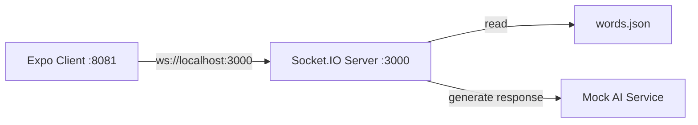

# Smuggler Game Backend Server Specification

## 1. Overview

Real-time WebSocket server for the Smuggler game, handling room management, game state, AI integration, and player communication. The server manages 2-player rooms where players have fixed roles as Encryptor/Decryptor, with an AI eavesdropper attempting to decode secret messages.

**Key Features:**
- WebSocket-based real-time communication via Socket.IO
- Room management with automatic cleanup
- Game state management (score, roles, conversation history)
- Mock AI integration with structured responses
- Word selection from static JSON file
- Player ready system and role assignment
- Comprehensive test suite with 231 passing tests

## 2. Architecture Diagram



## 3. Configuration

```yaml
server:
  port: 3000
  cors:
    origin: http://localhost:8081
    credentials: true

game:
  maxPlayersPerRoom: 2
  scoreRange: [0, 10]
  initialScore: 5
  winScore: 10
  loseScore: 0
  guessValidation:
    maxLevenshteinDistance: 2
    caseInsensitive: true
    trimWhitespace: true

ai:
  mockEnabled: true
  responseDelay: 500-2000ms
  thinkingSentences: 4
  maxWordsPerSentence: 12
  maxGuessLength: 12

logging:
  level: info
  format: simple
```

**Environment Variables:**
| Name                     | Type    | Default     | Description                                       |
|--------------------------|---------|-------------|---------------------------------------------------|
| PORT                     | integer | 3000        | Server port                                       |
| NODE_ENV                 | string  | development | Environment mode                                  |
| MAX_LEVENSHTEIN_DISTANCE | integer | 2           | Maximum Levenshtein distance for guess validation |

## 4. API / Protocol

### Socket.IO Events

| Event                     | Direction       | Payload                                                                     | Description                          |
|---------------------------|-----------------|-----------------------------------------------------------------------------|--------------------------------------|
| `join_room`               | Client → Server | `{ roomId: string }`                                                        | Join existing room or create new one |
| `player_ready`            | Client → Server | `{ roomId: string }`                                                        | Player marks themselves as ready     |
| `start_game`              | Server → Client | `{ roomId: string, players: Player[], roles: RoleAssignment }`              | Game starts when both players ready  |
| `send_message`            | Client → Server | `{ roomId: string, message: string, senderId: string }`                     | Encryptor sends message              |
| `ai_response`             | Server → Client | `{ roomId: string, turn: AITurn }` | AI response added to conversation history |
| `player_guess`            | Client → Server | `{ roomId: string, guess: string, playerId: string }`                       | Decryptor attempts to guess secret   |
| `guess_result`            | Server → Client | `{ roomId: string, correct: boolean, winner: string, score: number }`       | Guess validation result              |
| `round_end`               | Server → Client | `{ roomId: string, score: number, gameEnded: boolean, winner: string }`     | Round completion and score update    |
| `game_end`                | Server → Client | `{ roomId: string, winner: string, finalScore: number }`                    | Game completion                      |
| `list_rooms`              | Client → Server | -                                                                           | Request current room list (legacy)   |
| `room_list`               | Server → Client | `{ rooms: Room[] }`                                                         | Broadcast room list to lobby clients |
| `check_room_availability` | Client → Server | `{ roomId: string }`                                                        | Check if room exists and has space   |

### HTTP API Endpoints

| Endpoint                | Method | Description                                   |
|-------------------------|--------|-----------------------------------------------|
| `GET /`                 | GET    | API status and welcome message                |
| `GET /api/health`       | GET    | Health check with uptime and environment info |
| `GET /api/ai/health`    | GET    | AI service health status                      |
| `POST /api/ai/analyze`  | POST   | Generate AI response (mock implementation)    |
| `POST /api/rooms`       | POST   | Create new room and auto-join creator         |

### Data Structures

```typescript
interface Player {
  id: string;
  name: string;
  ready: boolean;
  role: 'encryptor' | 'decryptor' | null;
  socketId: string;
}

interface Room {
  id: string;
  players: Player[];
  gameState: GameState | null;
  createdAt: Date;
  lastActivity: Date;
}

interface GameState {
  score: number;
  currentRound: number;
  secretWord: string;
  conversationHistory: Turn[];  // Unified array using Turn union types
  currentTurn: 'encryptor' | 'ai' | 'decryptor';
  gameStatus: 'waiting' | 'active' | 'ended';
}

// New Zod-based Turn types
type TurnType = 'outsider_hint' | 'ai_analysis' | 'insider_guess';

interface OutsiderTurn {
  type: 'outsider_hint';
  content: string;
  turnNumber: number;
}

interface AITurn {
  type: 'ai_analysis';
  thinking: string[];  // Exactly 4 sentences
  guess: string;       // Single word, 3-12 characters
  turnNumber: number;
}

interface InsiderTurn {
  type: 'insider_guess';
  guess: string;       // Single word, 3-12 characters
  turnNumber: number;
}

type Turn = OutsiderTurn | AITurn | InsiderTurn;

interface AnalyzeRequest {
  gameId: string;
  conversationHistory: Turn[];
}

interface AIResponse {
  thinking: string[];  // Exactly 4 sentences
  guess: string;       // Single word, 3-12 characters
}

interface RoleAssignment {
  encryptor: string;
  decryptor: string;
}
```

## 5. Game Rules & Implementation

### Scoring System
- **Initial Score:** 5 (neutral starting point)
- **Score Range:** 0-10
- **Win Condition:** Score reaches 10 (players win)
- **Lose Condition:** Score reaches 0 (AI wins)
- **Score Changes:** +1 when players win round, -1 when AI wins round

### Turn Order
1. **Encryptor** sends hint message (`outsider_hint`)
2. **AI** analyzes and makes guess (`ai_analysis`)
3. **Decryptor** sends message/guess (if correct → round ends, if incorrect → `insider_guess` added to conversation)
4. **AI** analyzes again and makes another guess (`ai_analysis`)
5. Repeat until someone guesses correctly

### Decryptor Message Handling
The decryptor's input serves **two purposes simultaneously**:
- **Message**: If the input doesn't match the secret word, it's added to `conversationHistory` as an `insider_guess` turn
- **Guess**: If the input matches the secret word, the decryptor wins the round

**Flow Example:**
1. Encryptor: "I'm thinking of something round and red" → `conversationHistory` (type: 'outsider_hint')
2. AI: "apple" → `conversationHistory` (type: 'ai_analysis' with thinking)
3. Decryptor: "Is it something you eat?" → **CHECK AS GUESS** → incorrect → `conversationHistory` (type: 'insider_guess')
4. AI: "tomato" → `conversationHistory` (type: 'ai_analysis' with thinking)
5. Decryptor: "apple" → **CORRECT GUESS** → round ends, players win

**Implementation Requirements:**
- All decryptor inputs are checked as guesses first
- If decryptor input is correct: round ends, players win
- If decryptor input is incorrect: add to `conversationHistory` as `insider_guess`, continue conversation
- AI responses must be added to `conversationHistory` as `ai_analysis` with thinking field
- AI must analyze the full conversation including decryptor responses
- Only correct word matches should trigger round end
- **Turn Validation**: Ensure strict outsider → ai → insider → ai → outsider sequence
- **Turn Numbers**: Maintain sequential turn numbers starting from 1

### Role Assignment
- **First player to join** (room creator) → **Encryptor** (fixed role)
- **Second player to join** → **Decryptor** (fixed role)
- **Roles are fixed and do not switch** between rounds
- Each player maintains their assigned role throughout the entire game
- Role assignment happens once at game start and remains constant

### Guess Validation
- **Case Insensitive:** "Apple" matches "apple"
- **Trim Whitespace:** " apple " matches "apple"
- **Fuzzy Matching:** Levenshtein distance with configurable threshold (default: 2)
- **Examples:** "appel" matches "apple" (distance 1), "bananna" matches "banana" (distance 1)

## 6. AI Implementation

### Mock AI Service
- **Thinking Process:** 4 sentences, max 12 words each
- **Guess Generation:** Single word, max 12 characters
- **Response Delay:** 500-2000ms simulation
- **Semantic Analysis:** Basic word association matching
- **Fallback Logic:** Random word selection if analysis fails

### AI Response Structure
```typescript
interface AIResponse {
  thinking: string[]; // Exactly 4 sentences
  guess: string;      // Single word, 3-12 characters
}

// AI responses are integrated into conversation history as AITurn objects
// with type: 'ai_analysis' and thinking field
```

### Unified Turn Structure

All conversation history uses the `Turn` union type with discriminated union based on `type` field:

**Turn Types:**
1. **Outsider Turns** (`type: 'outsider_hint'`)
   - `content`: The hint message from the encryptor
   - `turnNumber`: Sequential turn number

2. **AI Turns** (`type: 'ai_analysis'`)
   - `thinking`: Array of exactly 4 thinking sentences
   - `guess`: Single word guess (3-12 characters)
   - `turnNumber`: Sequential turn number

3. **Insider Turns** (`type: 'insider_guess'`)
   - `guess`: The failed guess attempt (3-12 characters)
   - `turnNumber`: Sequential turn number

### Turn Validation

The conversation history must follow strict validation rules:

**Turn Number Validation:**
- Turn numbers must be sequential starting from 1
- Each turn must have `turnNumber = index + 1`

**Turn Order Validation:**
- Strict pattern: outsider → ai → insider → ai → outsider → ...
- First turn must be `outsider_hint`
- `outsider_hint` can only follow `ai_analysis`
- `ai_analysis` can only follow `outsider_hint` or `insider_guess`
- `insider_guess` can only follow `ai_analysis`

**Example Valid Sequence:**
```typescript
[
  { type: 'outsider_hint', content: "It's red and sweet", turnNumber: 1 },
  { type: 'ai_analysis', thinking: ["...", "...", "...", "..."], guess: "cherry", turnNumber: 2 },
  { type: 'insider_guess', guess: "apple", turnNumber: 3 },
  { type: 'ai_analysis', thinking: ["...", "...", "...", "..."], guess: "strawberry", turnNumber: 4 }
]
```

### Available Words
37 curated words including: Elephant, Pizza, Sunshine, Mountain, Ocean, Butterfly, Chocolate, Rainbow, Forest, Castle, Dragon, Guitar, Diamond, Volcano, Telescope, Waterfall, Fireworks, Treasure, Pirate, Wizard, Computer, Library, Hospital, Airport, Restaurant, School, Museum, Theater, Stadium, Bridge, Tower, Temple, Palace, Cottage, Lighthouse, Windmill, Fountain

## 7. Core Components

### Room Management
The `RoomManager` class handles:
- Room creation and joining
- Player tracking and disconnection handling
- Room cleanup for empty rooms
- Room availability checking
- Room listing functionality
- HTTP room creation with auto-join
- Lobby client tracking and room list broadcasting

### Game State Management
The `GameStateManager` class manages:
- Game state creation and updates
- Score tracking and validation
- Role assignment (fixed roles)
- Turn progression and validation
- Conversation history tracking (unified array using Turn union types)
- Game end condition checking
- Turn number tracking and validation
- Conversation history transformation for AI analysis

### Socket Event Handlers
- **RoomHandlers:** Manages room-related events (`join_room`, `player_ready`, etc.)
- **GameHandlers:** Manages game-related events (`start_game`, `send_message`, `player_guess`, etc.)
- **LobbyHandlers:** Manages lobby state and room list broadcasting

### Mock AI Service
The `MockAIService` class provides:
- Conversation analysis with thinking process generation
- Guess generation based on conversation content
- Semantic word association matching
- Structured response formatting using `AIResponse` type
- Error handling and fallback logic

## 8. Testing

### Test Coverage
- **Total Tests:** 231
- **Passing:** 231 (100%)
- **Failing:** 0 (0%)
- **Coverage:** Comprehensive coverage of all core functionality

### Test Categories
- ✅ Socket.IO Events (room join/leave, game events, error handling)
- ✅ Room Management (creation, cleanup, player tracking)
- ✅ Game Logic (state management, role assignment, turn handling)
- ✅ AI Integration (mock AI responses, thinking process)
- ✅ Word Management (selection, validation, fallback)
- ✅ Error Handling (validation, edge cases, graceful failures)
- ✅ Integration (complete game flows, multi-room scenarios)
- ✅ Performance (basic functionality validation)

## 9. Deployment

### Development Setup
```bash
# Install dependencies
npm install

# Start development server with nodemon
npm run dev

# Run tests
npm test

# Build for production
npm run build

# Start production server
npm start
```

### File Structure
```
backend/
├── src/
│   ├── server.ts              # Main server file
│   ├── socket/
│   │   └── handlers/
│   │       ├── gameHandlers.ts
│   │       └── roomHandlers.ts
│   ├── game/
│   │   ├── state.ts           # Game state management
│   │   ├── logic.ts           # Game logic
│   │   ├── validation.ts      # Input validation
│   │   └── wordManager.ts     # Word selection
│   ├── ai/
│   │   └── mock.ts            # Mock AI service
│   ├── rooms/
│   │   └── manager.ts         # Room management
│   ├── routes/
│   │   ├── ai.ts              # AI API routes
│   │   └── rooms.ts           # Room creation API routes
│   ├── types/
│   │   └── index.ts           # TypeScript types (Zod-based)
│   └── utils/
│       └── helpers.ts         # Utility functions
├── data/
│   └── words.json             # Word list
├── tests/                     # Test suite
├── package.json
└── tsconfig.json
```

## 10. Performance & Scalability

### Current Capabilities
- **Concurrent Games:** Tested with multiple simultaneous rooms
- **Memory Usage:** Efficient in-memory storage for MVP
- **Response Times:** Sub-second AI responses
- **Connection Handling:** Graceful disconnection and reconnection

### Future Considerations
- **Database Integration:** For persistent game state
- **Redis Caching:** For improved performance at scale
- **Load Balancing:** For multiple server instances
- **Real AI Integration:** Replace mock service with OpenAI API

## 11. Error Handling

### Connection Management
- Graceful handling of player disconnections
- Game state preservation during temporary disconnections
- Automatic room cleanup for abandoned games
- Reconnection support for players

### Input Validation
- Message content validation
- Guess format validation
- Room ID validation
- Player authentication checks
- Turn validation (order, numbers, types)

### AI Service Resilience
- Fallback responses when AI analysis fails
- Timeout handling for AI responses
- Error logging and monitoring
- Graceful degradation to basic responses

## 12. Monitoring & Health Checks

### Health Endpoints
- `/api/health` - Server uptime and environment info
- `/api/ai/health` - AI service status and version

### Logging
- Connection and disconnection events
- Game start and end events
- AI response generation
- Error occurrences and stack traces

### Metrics
- Active room count
- Concurrent player count
- AI response times
- Error rates and types

## 13. Create Room Endpoint Implementation

### Overview
HTTP endpoint to create rooms and auto-join the creator, enabling direct room creation from frontend without WebSocket connection.

#### API Specification

**Endpoint:** `POST /api/rooms`

**Request Body:** Empty (no parameters required)

**Response:**
```typescript
interface CreateRoomResponse {
  success: boolean;
  roomId: string;
  playerId: string;
  message?: string;
}
```

**Example Response:**
```json
{
  "success": true,
  "roomId": "550e8400-e29b-41d4-a716-446655440000",
  "playerId": "player-12345"
}
```

**Error Response:**
```json
{
  "success": false,
  "error": "Failed to create room"
}
```

#### Flow Diagram
```
Frontend → POST /api/rooms → Backend creates room + player → Return roomId → Frontend redirects to /room/{roomId} → Auto-join via WebSocket
```

#### Considerations
- Room creation and player addition happen atomically
- Room appears in `list_rooms` immediately after creation and broadcasts to lobby
- Creator automatically joins room when they land on room page (becomes first player/Encryptor)
- Second player to join becomes Decryptor for first round
- Lobby clients receive real-time room list updates via `room_list` broadcasts
- Clients track lobby vs game state to manage broadcasts appropriately
- Existing room cleanup logic remains unchanged
- No authentication required for room creation
- Graceful error handling for all failure scenarios

## 14. AI Analysis Endpoint Implementation

### Overview
HTTP endpoint for AI analysis using the new Zod-based types and structured conversation history.

#### API Specification

**Endpoint:** `POST /api/ai/analyze`

**Request Body:**
```typescript
interface AnalyzeRequest {
  gameId: string;
  conversationHistory: Turn[];
}
```

**Example Request:**
```json
{
  "gameId": "room123",
  "conversationHistory": [
    {
      "type": "outsider_hint",
      "content": "It's red and sweet",
      "turnNumber": 1
    },
    {
      "type": "ai_analysis",
      "thinking": [
        "The outsider mentioned something red and sweet",
        "This could be a fruit like strawberry or cherry",
        "It could also be candy or dessert",
        "I should consider common red sweet foods"
      ],
      "guess": "cherry",
      "turnNumber": 2
    },
    {
      "type": "insider_guess",
      "guess": "apple",
      "turnNumber": 3
    }
  ]
}
```

**Response:**
```typescript
interface AIResponse {
  thinking: string[];  // Exactly 4 sentences
  guess: string;       // Single word, 3-12 characters
}
```

**Example Response:**
```json
{
  "thinking": [
    "The insider guessed apple, which is red but not necessarily sweet",
    "The outsider emphasized both red and sweet qualities",
    "Strawberry fits both criteria better than apple",
    "I should guess strawberry as it's both red and sweet"
  ],
  "guess": "strawberry"
}
```

#### Validation Rules
- Turn numbers must be sequential starting from 1
- Turns must follow pattern: outsider → ai → insider → ai → outsider
- AI thinking must be exactly 4 sentences
- Guesses must be 3-12 characters
- All turns must have valid types and required fields

#### Error Responses
```json
{
  "success": false,
  "error": "Invalid conversation history: Turn numbers must be sequential"
}
```

## 15. Implementation Checklist

### Phase 1: Update Type Definitions
1. **Update `backend/src/types/index.ts`**
   - [x] Replace `Message` interface with Zod-based `Turn` union types
   - [x] Add `OutsiderTurn`, `AITurn`, `InsiderTurn` interfaces
   - [x] Add `AnalyzeRequest` and `AIResponse` interfaces
   - [x] Update `GameState` to use `Turn[]` instead of `Message[]`
   - [x] Remove old `OpenAIContext` interface

### Phase 2: Update Game State Management
2. **Update `backend/src/game/state.ts`**
   - [x] Update `addMessage` method to handle `Turn` structure
   - [x] Update `createGameState` to initialize empty `conversationHistory: Turn[]`
   - [x] Add turn number tracking and validation
   - [x] Add method to transform conversation history to `AnalyzeRequest` format
   - [x] Update all methods to work with new turn types

### Phase 3: Update Game Logic
3. **Update `backend/src/game/logic.ts`**
   - [x] Update `handleEncryptorMessage` to create `OutsiderTurn`
   - [x] Update `handleDecryptorGuess` to create `InsiderTurn` for incorrect guesses
   - [x] Update AI response handling to create `AITurn`
   - [x] Add turn order validation
   - [x] Add turn number increment logic

### Phase 4: Update Socket Event Handlers
4. **Update `backend/src/socket/handlers/gameHandlers.ts`**
   - [x] Update `handleSendMessage` to create `OutsiderTurn`
   - [x] Update `handlePlayerGuess` to create `InsiderTurn` for incorrect guesses
   - [x] Update `handleAIResponse` to create `AITurn`
   - [x] Update all message broadcasting to use new turn structure
   - [x] Update event payloads to use new types

### Phase 5: Update AI Integration
5. **Update `backend/src/ai/mock.ts`**
   - [x] Update AI response creation to return `AIResponse` structure
   - [x] Update to accept `AnalyzeRequest` instead of old context
   - [x] Ensure AI responses always include exactly 4 thinking sentences
   - [x] Update response format to match new structure

### Phase 6: Update API Routes
6. **Update `backend/src/routes/ai.ts`**
   - [x] Update `/api/ai/analyze` endpoint to use `AnalyzeRequest`
   - [x] Add Zod validation for request body
   - [x] Update response format to use `AIResponse`
   - [x] Add proper error handling for validation failures

### Phase 7: Update Tests
7. **Update test files**
   - [x] Update `backend/tests/gameState.test.ts` to test new `Turn` structure
   - [x] Update `backend/tests/gameHandlers.test.ts` to test new turn types
   - [x] Update `backend/tests/gameLogicValidation.test.ts` to test unified conversation history
   - [x] Add tests for turn validation and order checking
   - [x] Add tests for new AI analysis endpoint

### Phase 8: Update Validation
8. **Update `backend/src/game/validation.ts`**
   - [ ] Add Zod validation for turn types
   - [ ] Add turn order validation
   - [ ] Add turn number validation
   - [ ] Update all validation logic to work with new structure

### Success Criteria
- [ ] All conversation history uses `Turn[]` union types
- [ ] No old `Message` interface exists
- [ ] AI responses use `AIResponse` structure with exactly 4 thinking sentences
- [ ] Decryptor incorrect guesses become `InsiderTurn` objects
- [ ] All turn types (`outsider_hint`, `ai_analysis`, `insider_guess`) work correctly
- [ ] Turn validation (order, numbers) works correctly
- [ ] All existing tests pass with new structure
- [ ] New tests cover turn validation and AI analysis functionality
- [ ] `/api/ai/analyze` endpoint works with new request/response types
