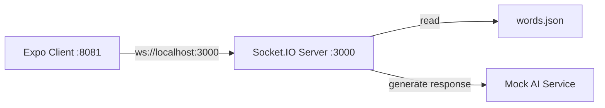

# Smuggler Game Backend Server Specification

## 1. Overview

Real-time WebSocket server for the Smuggler game, handling room management, game state, AI integration, and player communication. The server manages 2-player rooms where players take turns as Encryptor/Decryptor, with an AI eavesdropper attempting to decode secret messages.

**Key Features:**
- WebSocket-based real-time communication
- Room management with automatic cleanup
- Game state management (score, roles, conversation history)
- Mock AI integration with structured responses
- Word selection from static JSON file
- Player ready system and role assignment

## 2. Architecture Diagram



## 3. Configuration

```yaml
server:
  port: 3000
  cors:
    origin: http://localhost:8081
    credentials: true

game:
  maxPlayersPerRoom: 2
  scoreRange: [0, 10]
  winScore: 10
  loseScore: 0

ai:
  mockEnabled: true
  responseDelay: 0

logging:
  level: info
  format: simple
```

**Environment Variables:**
| Name | Type | Default | Description |
|------|------|---------|-------------|
| PORT | integer | 3000 | Server port |
| NODE_ENV | string | development | Environment mode |
| OPENAI_API_KEY | string | - | OpenAI API key (future use) |

## 4. API / Protocol

### Socket.IO Events

| Event | Direction | Payload | Description |
|-------|-----------|---------|-------------|
| `join_room` | Client → Server | `{ roomId: string }` | Join existing room or create new one |
| `player_ready` | Client → Server | `{ roomId: string }` | Player marks themselves as ready |
| `start_game` | Server → Client | `{ roomId: string, players: Player[], roles: RoleAssignment }` | Game starts when both players ready |
| `send_message` | Client → Server | `{ roomId: string, message: string, senderId: string }` | Encryptor sends message |
| `ai_response` | Server → Client | `{ roomId: string, thinking: string[], guess: string, confidence: number }` | AI thinking process and final guess |
| `player_guess` | Client → Server | `{ roomId: string, guess: string, playerId: string }` | Decryptor attempts to guess secret |
| `guess_result` | Server → Client | `{ roomId: string, correct: boolean, winner: string, score: number }` | Guess validation result |
| `round_end` | Server → Client | `{ roomId: string, score: number, gameEnded: boolean, winner: string }` | Round completion and score update |
| `game_end` | Server → Client | `{ roomId: string, winner: string, finalScore: number }` | Game completion |

### Data Structures

```typescript
interface Player {
  id: string;
  name: string;
  ready: boolean;
  role: 'encryptor' | 'decryptor' | null;
}

interface Room {
  id: string;
  players: Player[];
  gameState: GameState | null;
  createdAt: Date;
}

interface GameState {
  score: number;
  currentRound: number;
  secretWord: string;
  conversationHistory: Message[];
  aiGuesses: AIGuess[];
  currentTurn: 'encryptor' | 'ai' | 'decryptor';
  gameStatus: 'waiting' | 'active' | 'ended';
}

interface Message {
  id: string;
  content: string;
  senderId: string;
  timestamp: Date;
}

interface AIGuess {
  id: string;
  thinking: string[];
  guess: string;
  confidence: number;
  timestamp: Date;
}
```

## 5. Phases & Tasks

### Phase 1: Basic Server Setup
- [x] Initialize Socket.IO server with Express
- [x] Configure CORS for Expo client (localhost:8081)
- [x] Set up nodemon for development
- [x] Create basic health check endpoint
- [x] Add TypeScript configuration
- [x] Create server startup script
- [x] Add error handling middleware

### Phase 2: Room Management System
- [x] Implement room creation and joining logic
- [x] Add player tracking within rooms
- [x] Create room cleanup for empty rooms
- [x] Implement room state validation
- [x] Add room capacity limits (max 2 players)
- [x] Create room listing functionality
- [x] Add player disconnection handling
- [x] Implement room availability checking

### Phase 3: Game State Management
- [x] Create GameState interface and logic
- [x] Implement score tracking (0-10 range)
- [x] Add role assignment system (encryptor/decryptor)
- [x] Create conversation history tracking
- [x] Implement turn management system
- [x] Add round progression logic
- [x] Create game end conditions
- [x] Implement secret word selection from JSON

### Phase 4: Socket Event Handlers
- [ ] Implement `join_room` event handler
- [ ] Add `player_ready` event handler
- [ ] Create `start_game` event handler
- [ ] Implement `send_message` event handler
- [ ] Add `player_guess` event handler
- [ ] Create `guess_result` validation logic
- [ ] Implement `round_end` and `game_end` handlers
- [ ] Add event broadcasting to room players

### Phase 5: Mock AI Integration
- [ ] Create mock AI service
- [ ] Implement structured response generation
- [ ] Add thinking process simulation
- [ ] Create confidence scoring logic
- [ ] Implement guess generation from conversation
- [ ] Add AI response formatting
- [ ] Create error handling for AI service
- [ ] Add AI response timing simulation

### Phase 6: Word Management
- [ ] Create words.json file structure
- [ ] Implement word selection logic
- [ ] Add word validation and sanitization
- [ ] Create word list loading system
- [ ] Implement word difficulty categorization
- [ ] Add word uniqueness checking
- [ ] Create word fallback system
- [ ] Add word list monitoring

### Phase 7: Game Logic Implementation
- [ ] Implement guess validation (case-insensitive, fuzzy matching)
- [ ] Add score update logic (+1 for players, -1 for AI)
- [ ] Create round transition logic
- [ ] Implement role switching between rounds
- [ ] Add conversation flow validation
- [ ] Create turn order enforcement
- [ ] Implement game state persistence during disconnections
- [ ] Add game state recovery for rejoining players

### Phase 8: Testing & Validation
- [ ] Create Socket.IO event testing
- [ ] Add room management unit tests
- [ ] Implement game logic validation tests
- [ ] Create AI integration tests
- [ ] Add word selection tests
- [ ] Implement error handling tests
- [ ] Create integration test suite
- [ ] Add performance validation tests

## 6. Testing Strategy

### Unit Tests
- Room management logic
- Game state transitions
- Score calculation
- Word selection and validation
- AI response generation
- Socket event validation

### Integration Tests
- Complete game flow from join to end
- Player disconnection scenarios
- Room cleanup and recreation
- AI integration with game state
- Multi-room concurrent games

### Socket.IO Testing
- Event emission and reception
- Room broadcasting
- Connection state management
- Error handling and recovery

## 7. Monitoring & Metrics

### Basic Logging
- Room creation and deletion
- Game start and end events
- Player connections and disconnections
- AI response generation
- Error occurrences

### Health Checks
- Server uptime monitoring
- Socket connection status
- Memory usage tracking
- Active room count

## 8. Deployment

### Development Setup
```bash
# Install dependencies
npm install

# Start development server with nodemon
npm run dev

# Start production server
npm start
```

### File Structure
```
backend/
├── src/
│   ├── server.ts
│   ├── socket/
│   │   ├── handlers/
│   │   ├── events/
│   │   └── middleware/
│   ├── game/
│   │   ├── state.ts
│   │   ├── logic.ts
│   │   └── validation.ts
│   ├── ai/
│   │   └── mock.ts
│   ├── rooms/
│   │   └── manager.ts
│   └── utils/
│       ├── logger.ts
│       └── helpers.ts
├── data/
│   └── words.json
├── tests/
├── package.json
└── tsconfig.json
```

## 9. Success Criteria

### Core Functionality
- [ ] Server starts on port 3000 with Socket.IO
- [ ] Expo client can connect from localhost:8081
- [ ] Players can join rooms and see other players
- [ ] Game starts when both players click ready
- [ ] Encryptor can send messages to Decryptor
- [ ] AI generates mock responses with thinking process
- [ ] Decryptor can attempt guesses
- [ ] Score updates correctly (+1/-1 per round)
- [ ] Game ends at score 10 (players win) or 0 (AI wins)
- [ ] Roles switch between rounds

### Technical Requirements
- [ ] All Socket.IO events work correctly
- [ ] Room cleanup happens automatically
- [ ] Game state persists during player disconnections
- [ ] New players can join ongoing games
- [ ] Mock AI generates structured responses
- [ ] Word selection works from JSON file
- [ ] Guess validation handles case-insensitive matching
- [ ] Server handles concurrent games without conflicts
- [ ] All unit tests pass
- [ ] Integration tests validate complete game flow

### Development Experience
- [ ] Nodemon restarts server on file changes
- [ ] TypeScript compilation works without errors
- [ ] Clear error messages for debugging
- [ ] Health endpoint returns 200 status
- [ ] Logging provides useful debugging information
