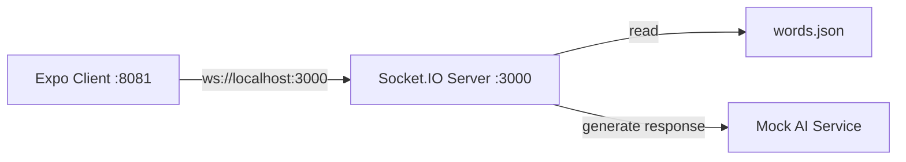

# Smuggler Game Backend Server Specification

## 1. Overview

Real-time WebSocket server for the Smuggler game, handling room management, game state, AI integration, and player communication. The server manages 2-player rooms where players take turns as Encryptor/Decryptor, with an AI eavesdropper attempting to decode secret messages.

**Key Features:**
- WebSocket-based real-time communication via Socket.IO
- Room management with automatic cleanup
- Game state management (score, roles, conversation history)
- Mock AI integration with structured responses
- Word selection from static JSON file
- Player ready system and role assignment
- Comprehensive test suite with 231 passing tests

## 2. Architecture Diagram



## 3. Configuration

```yaml
server:
  port: 3000
  cors:
    origin: http://localhost:8081
    credentials: true

game:
  maxPlayersPerRoom: 2
  scoreRange: [0, 10]
  initialScore: 5
  winScore: 10
  loseScore: 0
  guessValidation:
    maxLevenshteinDistance: 2
    caseInsensitive: true
    trimWhitespace: true

ai:
  mockEnabled: true
  responseDelay: 500-2000ms
  thinkingSentences: 4
  maxWordsPerSentence: 12
  maxGuessLength: 12

logging:
  level: info
  format: simple
```

**Environment Variables:**
| Name                     | Type    | Default     | Description                                       |
|--------------------------|---------|-------------|---------------------------------------------------|
| PORT                     | integer | 3000        | Server port                                       |
| NODE_ENV                 | string  | development | Environment mode                                  |
| MAX_LEVENSHTEIN_DISTANCE | integer | 2           | Maximum Levenshtein distance for guess validation |

## 4. API / Protocol

### Socket.IO Events

| Event                     | Direction       | Payload                                                                     | Description                          |
|---------------------------|-----------------|-----------------------------------------------------------------------------|--------------------------------------|
| `join_room`               | Client → Server | `{ roomId: string }`                                                        | Join existing room or create new one |
| `player_ready`            | Client → Server | `{ roomId: string }`                                                        | Player marks themselves as ready     |
| `start_game`              | Server → Client | `{ roomId: string, players: Player[], roles: RoleAssignment }`              | Game starts when both players ready  |
| `send_message`            | Client → Server | `{ roomId: string, message: string, senderId: string }`                     | Encryptor sends message              |
| `ai_response`             | Server → Client | `{ roomId: string, thinking: string[], guess: string, confidence: number }` | AI thinking process and final guess  |
| `player_guess`            | Client → Server | `{ roomId: string, guess: string, playerId: string }`                       | Decryptor attempts to guess secret   |
| `guess_result`            | Server → Client | `{ roomId: string, correct: boolean, winner: string, score: number }`       | Guess validation result              |
| `round_end`               | Server → Client | `{ roomId: string, score: number, gameEnded: boolean, winner: string }`     | Round completion and score update    |
| `game_end`                | Server → Client | `{ roomId: string, winner: string, finalScore: number }`                    | Game completion                      |
| `list_rooms`              | Client → Server | -                                                                           | Get list of available rooms          |
| `check_room_availability` | Client → Server | `{ roomId: string }`                                                        | Check if room exists and has space   |

### HTTP API Endpoints

| Endpoint                | Method | Description                                 |
|-------------------------|--------|-----------------------------------------------|
| `GET /`                 | GET    | API status and welcome message                |
| `GET /api/health`       | GET    | Health check with uptime and environment info |
| `GET /api/ai/health`    | GET    | AI service health status                      |
| `POST /api/ai/response` | POST   | Generate AI response (mock implementation)    |
| `POST /api/rooms`       | POST   | Create new room and auto-join creator         |

### Data Structures

```typescript
interface Player {
  id: string;
  name: string;
  ready: boolean;
  role: 'encryptor' | 'decryptor' | null;
}

interface Room {
  id: string;
  players: Player[];
  gameState: GameState | null;
  createdAt: Date;
}

interface GameState {
  score: number;
  currentRound: number;
  secretWord: string;
  conversationHistory: Message[];
  aiGuesses: AIGuess[];
  currentTurn: 'encryptor' | 'ai' | 'decryptor';
  gameStatus: 'waiting' | 'active' | 'ended';
}

interface Message {
  id: string;
  content: string;
  senderId: string;
  timestamp: Date;
}

interface AIGuess {
  id: string;
  thinking: string[];
  guess: string;
  confidence: number;
  timestamp: Date;
}

interface RoleAssignment {
  encryptor: string;
  decryptor: string;
}
```

## 5. Game Rules & Implementation

### Scoring System
- **Initial Score:** 5 (neutral starting point)
- **Score Range:** 0-10
- **Win Condition:** Score reaches 10 (players win)
- **Lose Condition:** Score reaches 0 (AI wins)
- **Score Changes:** +1 when players win round, -1 when AI wins round

### Turn Order
1. **Encryptor** sends message
2. **AI** analyzes and makes guess
3. **Decryptor** attempts to guess
4. **AI** analyzes again and makes another guess
5. Repeat until someone guesses correctly

### Role Assignment
- Random assignment at game start
- Roles switch between rounds
- Each player gets equal turns as encryptor/decryptor

### Guess Validation
- **Case Insensitive:** "Apple" matches "apple"
- **Trim Whitespace:** " apple " matches "apple"
- **Fuzzy Matching:** Levenshtein distance with configurable threshold (default: 2)
- **Examples:** "appel" matches "apple" (distance 1), "bananna" matches "banana" (distance 1)

## 6. AI Implementation

### Mock AI Service
- **Thinking Process:** 4 sentences, max 12 words each
- **Guess Generation:** Single word, max 12 characters
- **Response Delay:** 500-2000ms simulation
- **Semantic Analysis:** Basic word association matching
- **Fallback Logic:** Random word selection if analysis fails

### AI Response Structure
```typescript
interface AIResponse {
  thinking: string[]; // Exactly 4 sentences
  guess: string;      // Single word
}
```

### Available Words
37 curated words including: Elephant, Pizza, Sunshine, Mountain, Ocean, Butterfly, Chocolate, Rainbow, Forest, Castle, Dragon, Guitar, Diamond, Volcano, Telescope, Waterfall, Fireworks, Treasure, Pirate, Wizard, Computer, Library, Hospital, Airport, Restaurant, School, Museum, Theater, Stadium, Bridge, Tower, Temple, Palace, Cottage, Lighthouse, Windmill, Fountain

## 7. Core Components

### Room Management
The `RoomManager` class handles:
- Room creation and joining
- Player tracking and disconnection handling
- Room cleanup for empty rooms
- Room availability checking
- Room listing functionality
- HTTP room creation with auto-join

### Game State Management
The `GameStateManager` class manages:
- Game state creation and updates
- Score tracking and validation
- Role assignment and switching
- Turn progression and validation
- Conversation history tracking
- AI guess integration
- Game end condition checking

### Socket Event Handlers
- **RoomHandlers:** Manages room-related events (`join_room`, `player_ready`, etc.)
- **GameHandlers:** Manages game-related events (`start_game`, `send_message`, `player_guess`, etc.)

### Mock AI Service
The `MockAIService` class provides:
- Conversation analysis with thinking process generation
- Guess generation based on conversation content
- Semantic word association matching
- Structured response formatting
- Error handling and fallback logic

## 8. Testing

### Test Coverage
- **Total Tests:** 231
- **Passing:** 231 (100%)
- **Failing:** 0 (0%)
- **Coverage:** Comprehensive coverage of all core functionality

### Test Categories
- ✅ Socket.IO Events (room join/leave, game events, error handling)
- ✅ Room Management (creation, cleanup, player tracking)
- ✅ Game Logic (state management, role assignment, turn handling)
- ✅ AI Integration (mock AI responses, thinking process)
- ✅ Word Management (selection, validation, fallback)
- ✅ Error Handling (validation, edge cases, graceful failures)
- ✅ Integration (complete game flows, multi-room scenarios)
- ✅ Performance (basic functionality validation)

## 9. Deployment

### Development Setup
```bash
# Install dependencies
npm install

# Start development server with nodemon
npm run dev

# Run tests
npm test

# Build for production
npm run build

# Start production server
npm start
```

### File Structure
```
backend/
├── src/
│   ├── server.ts              # Main server file
│   ├── socket/
│   │   └── handlers/
│   │       ├── gameHandlers.ts
│   │       └── roomHandlers.ts
│   ├── game/
│   │   ├── state.ts           # Game state management
│   │   ├── logic.ts           # Game logic
│   │   ├── validation.ts      # Input validation
│   │   └── wordManager.ts     # Word selection
│   ├── ai/
│   │   └── mock.ts            # Mock AI service
│   ├── rooms/
│   │   └── manager.ts         # Room management
│   ├── routes/
│   │   ├── ai.ts              # AI API routes
│   │   └── rooms.ts           # Room creation API routes
│   ├── types/
│   │   └── index.ts           # TypeScript types
│   └── utils/
│       └── helpers.ts         # Utility functions
├── data/
│   └── words.json             # Word list
├── tests/                     # Test suite
├── package.json
└── tsconfig.json
```

## 10. Performance & Scalability

### Current Capabilities
- **Concurrent Games:** Tested with multiple simultaneous rooms
- **Memory Usage:** Efficient in-memory storage for MVP
- **Response Times:** Sub-second AI responses
- **Connection Handling:** Graceful disconnection and reconnection

### Future Considerations
- **Database Integration:** For persistent game state
- **Redis Caching:** For improved performance at scale
- **Load Balancing:** For multiple server instances
- **Real AI Integration:** Replace mock service with OpenAI API

## 11. Error Handling

### Connection Management
- Graceful handling of player disconnections
- Game state preservation during temporary disconnections
- Automatic room cleanup for abandoned games
- Reconnection support for players

### Input Validation
- Message content validation
- Guess format validation
- Room ID validation
- Player authentication checks

### AI Service Resilience
- Fallback responses when AI analysis fails
- Timeout handling for AI responses
- Error logging and monitoring
- Graceful degradation to basic responses

## 12. Monitoring & Health Checks

### Health Endpoints
- `/api/health` - Server uptime and environment info
- `/api/ai/health` - AI service status and version

### Logging
- Connection and disconnection events
- Game start and end events
- AI response generation
- Error occurrences and stack traces

### Metrics
- Active room count
- Concurrent player count
- AI response times
- Error rates and types

## 13. Create Room Endpoint Implementation

### Overview
New HTTP endpoint to create rooms and auto-join the creator, enabling direct room creation from frontend without WebSocket connection.

### Implementation Checklist

#### Backend Changes
- [ ] **Create `src/routes/rooms.ts`**
  - [ ] Add `POST /api/rooms` endpoint
  - [ ] Generate random UUID for room ID
  - [ ] Create room with empty player list
  - [ ] Generate player ID for creator
  - [ ] Add creator as first player in room
  - [ ] Return room ID and player info in response

- [ ] **Update `src/server.ts`**
  - [ ] Import and register rooms routes
  - [ ] Add route middleware for `/api/rooms`

- [ ] **Update `src/rooms/manager.ts`**
  - [ ] Add `createRoomWithPlayer()` method
  - [ ] Handle room creation + player addition in single operation
  - [ ] Ensure room appears in `list_rooms` immediately

- [ ] **Update `src/types/index.ts`**
  - [ ] Add `CreateRoomResponse` interface
  - [ ] Add `CreateRoomRequest` interface (empty for now)

#### Frontend Integration Guide

**For Frontend Developer:**

1. **Create Room Button Implementation**
   ```javascript
   // Make HTTP POST request to create room
   const createRoom = async () => {
     try {
       const response = await fetch('/api/rooms', {
         method: 'POST',
         headers: { 'Content-Type': 'application/json' }
       });
       const data = await response.json();
       
       if (data.success) {
         // Redirect to room page
         router.push(`/room/${data.roomId}`);
       } else {
         // Handle error
         console.error('Failed to create room:', data.error);
       }
     } catch (error) {
       console.error('Error creating room:', error);
     }
   };
   ```

2. **Room Page Auto-Join Implementation**
   ```javascript
   // On room page load (e.g., useEffect or componentDidMount)
   const joinRoom = (roomId) => {
     // Connect to WebSocket if not already connected
     if (!socket.connected) {
       socket.connect();
     }
     
     // Join room using existing WebSocket event
     socket.emit('join_room', { roomId });
     
     // Handle join responses
     socket.on('room_joined', (data) => {
       // Room joined successfully
     });
     
     socket.on('room_full', () => {
       // Redirect to homepage if room is full
       router.push('/');
     });
     
     socket.on('room_not_found', () => {
       // Redirect to homepage if room doesn't exist
       router.push('/');
     });
   };
   ```

3. **Required Routes**
   - `/room/{roomId}` - Room page that auto-joins on load
   - `/` - Homepage with create room button

4. **Error Handling**
   - Handle network errors during room creation
   - Handle room full/not found scenarios
   - Provide user feedback for all error states

#### Testing
- [ ] **Unit Tests**
  - [ ] Test room creation endpoint
  - [ ] Test room creation with player auto-join
  - [ ] Test error handling (server errors, validation)

- [ ] **Integration Tests**
  - [ ] Test complete flow: create room → redirect → auto-join
  - [ ] Test room creation from multiple clients
  - [ ] Test room cleanup still works properly

- [ ] **Frontend Integration Tests**
  - [ ] Test create room button functionality
  - [ ] Test room page auto-join behavior
  - [ ] Test error scenarios and redirects

#### API Specification

**Endpoint:** `POST /api/rooms`

**Request Body:** Empty (no parameters required)

**Response:**
```typescript
interface CreateRoomResponse {
  success: boolean;
  roomId: string;
  playerId: string;
  message?: string;
}
```

**Example Response:**
```json
{
  "success": true,
  "roomId": "550e8400-e29b-41d4-a716-446655440000",
  "playerId": "player-12345"
}
```

**Error Response:**
```json
{
  "success": false,
  "error": "Failed to create room"
}
```

#### Flow Diagram
```
Frontend → POST /api/rooms → Backend creates room + player → Return roomId → Frontend redirects to /room/{roomId} → Auto-join via WebSocket
```

#### Considerations
- Room creation and player addition happen atomically
- Room appears in `list_rooms` immediately after creation
- Creator automatically joins room when they land on room page
- Existing room cleanup logic remains unchanged
- No authentication required for room creation
- Graceful error handling for all failure scenarios
