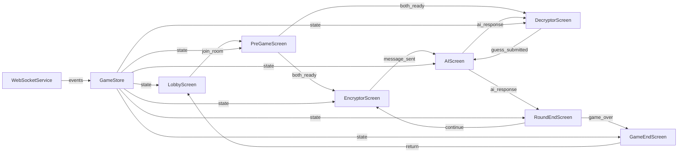

# Smuggler Game Frontend Client Specification

## 1. Overview

React Native/Expo frontend for the Smuggler game, providing a real-time multiplayer experience where two players work together to communicate secretly while an AI eavesdropper attempts to decode their messages.

**Key Features:**
- Real-time WebSocket communication via Socket.IO
- Zustand state management for game state
- Multi-screen game flow with role-based views
- AI interaction screen with synchronized viewing
- Room management and lobby system
- Responsive UI with proper error handling

## 2. Architecture Diagram



## 3. Configuration

```yaml
frontend:
  environment: development
  backend_url: http://localhost:3000
  websocket:
    transports: ["websocket"]
    auto_connect: true
    timeout: 5000

navigation:
  auto_redirect: true
  transition_delay: 3000

ui:
  colors:
    primary: "#007AFF"
    success: "#4CAF50"
    error: "#F44336"
    warning: "#FF9800"
    background: "#f5f5f5"
    text: "#333333"
  
  typography:
    headers: "bold, 20-24px"
    body: "regular, 16px"
    captions: "regular, 14px"
    buttons: "semi-bold, 16-18px"

game:
  max_players_per_room: 2
  initial_score: 5
  win_score: 10
  lose_score: 0
  ai_thinking_delay: 1500
  round_transition_delay: 3000
```

## 4. API / Protocol

### WebSocket Events

| Event | Direction | Payload | Description |
|-------|-----------|---------|-------------|
| `join_room` | Client → Server | `{ roomId: string, playerName: string }` | Join existing room |
| `join_room_success` | Server → Client | `{ roomId: string, players: Player[], playerId: string }` | Room joined successfully |
| `player_ready` | Client → Server | `{ ready: boolean }` | Mark player as ready |
| `room:playerReady` | Server → Client | `{ playerId: string, ready: boolean }` | Player ready status update |
| `start_game` | Server → Client | `{ roomId: string, players: Player[], roles: RoleAssignment, secretWord: string }` | Game starts |
| `send_message` | Client → Server | `{ content: string }` | Encryptor sends message |
| `ai_response` | Server → Client | `{ roomId: string, thinking: string[], guess: string, confidence: number }` | AI analysis and guess |
| `player_guess` | Client → Server | `{ guess: string }` | Decryptor submits guess |
| `guess_result` | Server → Client | `{ roomId: string, correct: boolean, winner: string, score: number }` | Guess validation result |
| `round_end` | Server → Client | `{ roomId: string, score: number, gameEnded: boolean, winner: string }` | Round completion |
| `game_end` | Server → Client | `{ roomId: string, winner: string, finalScore: number }` | Game completion |
| `room_list` | Server → Client | `{ rooms: Room[] }` | Available rooms list |
| `error` | Server → Client | `{ message: string }` | Error notification |

### HTTP Endpoints

| Endpoint | Method | Description |
|----------|--------|-------------|
| `POST /api/rooms` | POST | Create new room and auto-join creator |
| `GET /api/health` | GET | Backend health check |

### State Management

| State Property | Type | Description |
|----------------|------|-------------|
| `connected` | boolean | WebSocket connection status |
| `roomId` | string \| null | Current room identifier |
| `player` | Player \| null | Current player information |
| `players` | Player[] | All players in current room |
| `gameStatus` | 'waiting' \| 'active' \| 'ended' | Current game state |
| `role` | 'encryptor' \| 'decryptor' \| null | Player's fixed role |
| `round` | number | Current round number |
| `score` | number | Current game score |
| `secretWord` | string \| null | Current round's secret word |
| `encryptedMessage` | string \| null | Current round's encrypted message |
| `aiResponse` | AIResponse \| null | Current AI analysis and guess |
| `currentScreen` | ScreenType | Current active screen |
| `loading` | boolean | Loading state indicator |
| `error` | string \| null | Error message |

## 5. Phases & Tasks

### Phase 1: Core Infrastructure Setup
- [ ] Set up Zustand store with game state management
- [ ] Implement WebSocket service with Socket.IO client
- [ ] Create connection management and error handling
- [ ] Set up navigation structure with Expo Router
- [ ] Implement basic UI components (ConnectionStatus, GameHeader)
- [ ] Create loading and error state components
- [ ] Set up environment configuration
- [ ] Implement basic state persistence

### Phase 2: Lobby and Room Management
- [ ] Create LobbyScreen with room list display
- [ ] Implement room creation via HTTP API
- [ ] Add room joining functionality
- [ ] Create room list refresh mechanism
- [ ] Implement connection status indicators
- [ ] Add error handling for room operations
- [ ] Create room availability checking
- [ ] Implement lobby auto-refresh functionality

### Phase 3: PreGame and Player Ready System
- [ ] Create PreGameScreen with player list
- [ ] Implement ready/unready toggle functionality
- [ ] Add player status indicators
- [ ] Create auto-navigation when both players ready
- [ ] Implement leave room functionality
- [ ] Add game start detection and handling
- [ ] Create role assignment display
- [ ] Implement pregame error handling

### Phase 4: Game Screens Implementation
- [ ] Create EncryptorScreen with secret word display
- [ ] Implement message input and sending functionality
- [ ] Create DecryptorScreen with encrypted message display
- [ ] Add guess input and submission functionality
- [ ] Implement game status indicators
- [ ] Create round and score displays
- [ ] Add leave room functionality to game screens
- [ ] Implement game screen error handling

### Phase 5: AI Interaction Screen
- [ ] Create AIScreen with thinking process display
- [ ] Implement animated thinking sentence reveal
- [ ] Add AI guess display with confidence score
- [ ] Create synchronized viewing for both players
- [ ] Implement auto-navigation after AI responses
- [ ] Add loading animations and indicators
- [ ] Create AI response state management
- [ ] Implement AI screen error handling

### Phase 6: Round and Game End Screens
- [ ] Create RoundEndScreen with round summary
- [ ] Implement score update display
- [ ] Add continue to next round functionality
- [ ] Create GameEndScreen with final results
- [ ] Implement winner announcement display
- [ ] Add return to lobby functionality
- [ ] Create game statistics display
- [ ] Implement auto-navigation timers

### Phase 7: Navigation and State Management
- [ ] Implement auto-navigation rules between screens
- [ ] Create state-based screen transitions
- [ ] Add manual navigation controls
- [ ] Implement back button handling
- [ ] Create navigation error recovery
- [ ] Add state cleanup on navigation
- [ ] Implement deep linking support
- [ ] Create navigation state persistence

### Phase 8: Error Handling and Validation
- [ ] Implement comprehensive error handling
- [ ] Create user-friendly error messages
- [ ] Add input validation for messages and guesses
- [ ] Implement network error recovery
- [ ] Create connection retry mechanisms
- [ ] Add timeout handling for operations
- [ ] Implement graceful degradation
- [ ] Create error logging and reporting

## 6. Testing Strategy

### Unit Testing
- [ ] Test Zustand store state management
- [ ] Test WebSocket service functions
- [ ] Test navigation logic and rules
- [ ] Test error handling mechanisms
- [ ] Test input validation functions
- [ ] Test state persistence logic

### Integration Testing
- [ ] Test complete game flow from lobby to game end
- [ ] Test WebSocket event handling
- [ ] Test screen transitions and navigation
- [ ] Test multiplayer synchronization
- [ ] Test error recovery scenarios
- [ ] Test room management operations

### E2E Testing
- [ ] Test two-player game scenarios
- [ ] Test connection loss and recovery
- [ ] Test room creation and joining
- [ ] Test complete round flow
- [ ] Test game end conditions
- [ ] Test error scenarios and user feedback

## 7. Monitoring & Metrics

### Performance Metrics
- [ ] Screen transition times
- [ ] WebSocket connection latency
- [ ] State update response times
- [ ] Memory usage during gameplay
- [ ] Battery consumption metrics
- [ ] Network request success rates

### User Experience Metrics
- [ ] Game completion rates
- [ ] Player retention rates
- [ ] Error occurrence frequency
- [ ] Navigation pattern analysis
- [ ] Feature usage statistics
- [ ] User session duration

### Technical Metrics
- [ ] WebSocket connection stability
- [ ] State synchronization accuracy
- [ ] Error recovery success rates
- [ ] Memory leak detection
- [ ] Performance degradation tracking
- [ ] API response time monitoring

## 8. Deployment

### Development Environment
```bash
# Install dependencies
npm install

# Start development server
npm start

# Run tests
npm test

# Build for development
npm run build:dev
```

### Production Environment
```bash
# Build for production
npm run build:prod

# Deploy to app stores
npm run deploy:ios
npm run deploy:android

# Deploy web version
npm run deploy:web
```

### Environment Variables
| Variable | Type | Default | Description |
|----------|------|---------|-------------|
| `EXPO_PUBLIC_BACKEND_URL` | string | `http://localhost:3000` | Backend server URL |
| `EXPO_PUBLIC_ENVIRONMENT` | string | `development` | Environment mode |
| `EXPO_PUBLIC_WEBSOCKET_TIMEOUT` | number | `5000` | WebSocket timeout in ms |
| `EXPO_PUBLIC_AI_THINKING_DELAY` | number | `1500` | AI thinking animation delay |

## 9. Success Criteria

### Functional Requirements
- [ ] Players can create and join rooms successfully
- [ ] Game flow works from lobby to game end without errors
- [ ] AI responses display correctly for both players
- [ ] Score tracking works accurately throughout the game
- [ ] Navigation between screens is smooth and automatic
- [ ] Error handling provides clear user feedback
- [ ] WebSocket connection remains stable during gameplay

### Performance Requirements
- [ ] Screen transitions complete within 500ms
- [ ] WebSocket events process within 100ms
- [ ] State updates reflect immediately in UI
- [ ] Memory usage stays under 100MB during gameplay
- [ ] App remains responsive during AI analysis
- [ ] No memory leaks during extended gameplay sessions

### User Experience Requirements
- [ ] Players understand their roles and responsibilities
- [ ] Game flow feels natural and intuitive
- [ ] Error messages are clear and actionable
- [ ] Loading states provide appropriate feedback
- [ ] Navigation feels seamless and automatic
- [ ] Game maintains engagement throughout all phases

### Technical Requirements
- [ ] All unit tests pass with >90% coverage
- [ ] Integration tests validate complete game flows
- [ ] E2E tests confirm multiplayer functionality
- [ ] Error recovery mechanisms work reliably
- [ ] State management remains consistent
- [ ] WebSocket connection handles network issues gracefully
