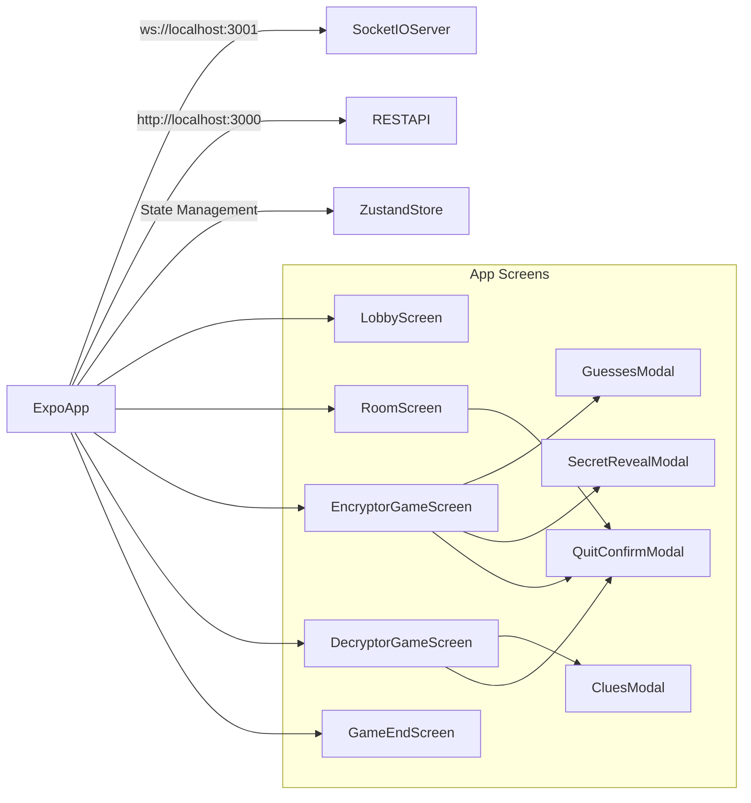

# Smuggler Frontend Specification

## 1. Overview

The Smuggler frontend is a React Native/Expo application that provides the client interface for the Smuggler word-guessing game. It connects to the backend via WebSocket for real-time gameplay and REST API for room management. The app follows a mobile-first design with separate screens for different game roles and states.

### Key Features
- Real-time multiplayer gameplay via WebSocket
- Separate encryptor and decryptor game interfaces
- Room creation and joining via lobby
- Auto-generated player names
- Mobile-optimized touch interface
- Zustand state management for complex game state
- Visual score progress bar with endpoints (AI Wins / Humans Win)
- Encoder-only "Secret" button to reveal the secret word
- Modal for previous guesses (Encoder) or clues (Decoder)
- Always-visible AI thinking/guess section
- Placeholder avatars for players
- Quit confirmation dialog

## 2. Architecture Diagram



## 3. Configuration

```yaml
# App Configuration
app:
  name: "Smuggler"
  version: "1.0.0"
  platform: "mobile"

# Backend Connection
backend:
  restUrl: "http://localhost:3000"
  socketUrl: "http://localhost:3001"
  corsOrigin: "http://localhost:8081"

# Game Configuration
game:
  autoNamePrefix: "Player"
  gameEndDelay: 5000

# UI Configuration
ui:
  primaryColor: "#007AFF"
  secondaryColor: "#5856D6"
  backgroundColor: "#F2F2F7"
  textColor: "#000000"
  errorColor: "#FF3B30"
  successColor: "#34C759"
  avatarPlaceholder: true
  scoreBar:
    endpoints:
      - "AI Wins"
      - "Humans Win"
    indicator: "dot"
    steps: 11 # Example, adjust as needed
  quitConfirmation: true
```

## 4. API / Protocol

### REST API Integration

| Endpoint      |Method  | Purpose      | Request Body | Response                      |
|---------------|--------|--------------|--------------|-------------------------------|
| `/api/rooms`  | POST   | Create room  | `{}`         | `{success, roomId, playerId}` |
| `/api/health` | GET    | Health check | -            | `{status, uptime}`            |

### WebSocket Events

| Event          | Direction | Data                          | Purpose             |
|----------------|-----------|-------------------------------|---------------------|
| `connection`   | In        | -                             | Client connects     |
| `disconnect`   | In        | -                             | Client disconnects  |
| `enter_lobby`  | Out       | -                             | Join global lobby   |
| `leave_lobby`  | Out       | -                             | Leave global lobby  |
| `join_room`    | Out       | `{roomId, playerId}`          | Join specific room  |
| `player_ready` | Out       | `{roomId, playerId, ready}`   | Mark player ready   |
| `list_rooms`   | Out       | -                             | Get available rooms |
| `start_game`   | Out       | `{roomId}`                    | Start game in room  |
| `send_message` | Out       | `{roomId, content, senderId}` | Send game message   |
| `player_guess` | Out       | `{roomId, guess, playerId}`   | Submit word guess   |

### State Management (Zustand)

```typescript
interface GameStore {
  // Connection state
  isConnected: boolean;
  socketId: string | null;
  
  // Player state
  playerId: string | null;
  playerName: string | null;
  playerRole: 'encryptor' | 'decryptor' | null;
  
  // Room state
  currentRoomId: string | null;
  roomPlayers: Player[];
  isReady: boolean;
  
  // Game state
  gameState: GameState | null;
  conversationHistory: Turn[];
  currentTurn: 'encryptor' | 'ai' | 'decryptor' | null;
  
  // UI state
  currentScreen: 'lobby' | 'room' | 'encryptor-game' | 'decryptor-game' | 'game-end';
  isLoading: boolean;
  error: string | null;
  showGuessesModal: boolean;
  showCluesModal: boolean;
  showSecretModal: boolean;
  showQuitConfirm: boolean;
  
  // Actions
  connect: () => void;
  disconnect: () => void;
  createRoom: () => Promise<void>;
  joinRoom: (roomId: string) => Promise<void>;
  setReady: (ready: boolean) => void;
  startGame: () => void;
  sendMessage: (content: string) => void;
  submitGuess: (guess: string) => void;
  leaveRoom: () => void;
  resetGame: () => void;
  openGuessesModal: () => void;
  closeGuessesModal: () => void;
  openCluesModal: () => void;
  closeCluesModal: () => void;
  openSecretModal: () => void;
  closeSecretModal: () => void;
  openQuitConfirm: () => void;
  closeQuitConfirm: () => void;
}
```

## 5. Phases & Tasks

### Phase 1: Project Setup & Core Infrastructure
- [x] Initialize Expo project with TypeScript
- [x] Install dependencies (Socket.IO client, Zustand, React Navigation)
- [x] Configure development environment and backend connections
- [x] Set up Zustand store with basic state structure
- [x] Create WebSocket service for backend communication
- [x] Implement basic error handling and connection management
- [x] Set up navigation structure and screen routing
- [x] Create basic UI components (buttons, inputs, cards)

### Phase 2: Lobby & Room Management (in progress)
- [x] Create LobbyScreen with create/join room options
- [x] Implement room creation via REST API
- [x] Add room listing functionality via WebSocket
- [x] Create RoomScreen for pre-game lobby
- [x] Implement player ready/unready functionality
- [x] Add player list display with ready status
- [x] Implement room joining with validation
- [x] Add auto-generated player names (Player 1, Player 2, etc.)

### Phase 3: Game State Management
- [x] Implement game state synchronization with backend
- [x] Create conversation history display component
- [x] Add real-time message updates via WebSocket
- [x] Implement turn-based game flow logic
- [x] Create role assignment and display
- [x] Add score progress bar with endpoints and indicator
- [x] Implement game start/end state management
- [x] Add game status indicators and loading states

### Phase 4: Encryptor Game Interface
- [x] Create EncryptorGameScreen component
- [x] Implement message input for encryptor hints
- [x] Add conversation history display for encryptor view
- [x] Add always-visible AI thinking/guess section
- [x] Add "Secret" button to reveal secret word (modal)
- [x] Add "Guesses" button to open previous guesses modal
- [x] Add placeholder avatar for decoder
- [x] Implement message sending functionality
- [x] Add input validation and error handling
- [x] Create mobile-optimized keyboard handling
- [x] Add encryptor-specific instructions and UI elements
- [x] Add quit confirmation dialog

### Phase 5: Decryptor Game Interface
- [ ] Create DecryptorGameScreen component
- [ ] Implement guess input functionality
- [ ] Add conversation history display for decryptor view
- [ ] Add always-visible AI thinking/guess section
- [ ] Add "Clues" button to open previous clues modal
- [ ] Add placeholder avatar for encoder
- [ ] Create guess submission and validation
- [ ] Implement AI turn display and processing
- [ ] Add decryptor-specific instructions and UI elements
- [ ] Create mobile-optimized input handling
- [ ] Add guess history and feedback display
- [ ] Add quit confirmation dialog

### Phase 6: Game End & Polish
- [ ] Create GameEndScreen with results display
- [ ] Implement 5-second delay before returning to lobby
- [ ] Add game end animations and visual feedback
- [ ] Implement proper navigation flow between screens
- [ ] Add connection error handling and reconnection logic
- [ ] Create loading states and skeleton screens
- [ ] Implement proper error boundaries and fallbacks
- [ ] Add basic accessibility features and screen reader support

## 6. Testing Strategy

### Unit Testing
- [ ] Zustand store actions and state updates
- [ ] WebSocket service connection handling
- [ ] REST API service calls
- [ ] Utility functions and helpers
- [ ] Component rendering and props

### Integration Testing
- [ ] Full game flow from lobby to game end
- [ ] WebSocket event handling and state synchronization
- [ ] Room creation and joining flow
- [ ] Real-time message updates
- [ ] Error handling and recovery scenarios

### Mobile Testing
- [ ] Touch interactions and gestures
- [ ] Keyboard input handling
- [ ] Screen orientation changes
- [ ] App state management (background/foreground)
- [ ] Network connectivity changes

## 7. Monitoring & Metrics

### Performance Metrics
- [ ] App launch time < 3 seconds
- [ ] Screen transitions < 300ms
- [ ] WebSocket connection time < 1 second
- [ ] Message send/receive latency < 100ms
- [ ] Memory usage < 100MB

### User Experience Metrics
- [ ] Game completion rate
- [ ] Average session duration
- [ ] Error rate and crash frequency
- [ ] Connection stability metrics
- [ ] User engagement patterns

### Technical Monitoring
- [ ] WebSocket connection status
- [ ] API response times
- [ ] State synchronization accuracy
- [ ] Memory leaks and performance issues
- [ ] Error tracking and reporting

## 8. Deployment

### Development Environment
- [ ] Expo development server on localhost:8081
- [ ] Hot reloading and live updates
- [ ] Debug tools and logging
- [ ] Backend connection to localhost:3000/3001

### Production Considerations
- [ ] Environment-specific configuration
- [ ] Production backend URL configuration
- [ ] App store deployment preparation
- [ ] Performance optimization
- [ ] Security hardening

## 9. Success Criteria

### Functional Requirements
- [ ] Users can create and join rooms successfully
- [ ] Real-time gameplay works without lag or disconnections
- [ ] Encryptor and decryptor screens function correctly
- [ ] Game state synchronizes properly between players
- [ ] Messages and guesses are transmitted accurately
- [ ] Game end flow works with proper delay and navigation
- [ ] Score progress bar and endpoints update correctly
- [ ] Secret reveal, guesses/clues modals, and quit confirmation work as intended

### Technical Requirements
- [ ] All WebSocket events handled correctly
- [ ] Zustand state management works without memory leaks
- [ ] Mobile UI is responsive and touch-friendly
- [ ] Error handling prevents app crashes
- [ ] Connection recovery works automatically
- [ ] Performance meets mobile app standards

### User Experience Requirements
- [ ] Intuitive navigation between screens
- [ ] Clear role-based interfaces for encryptor/decryptor
- [ ] Smooth real-time updates and animations
- [ ] Proper feedback for user actions
- [ ] Accessible design for different screen sizes
- [ ] Consistent visual design throughout the app
- [ ] Placeholder avatars and modal flows are clear and user-friendly
