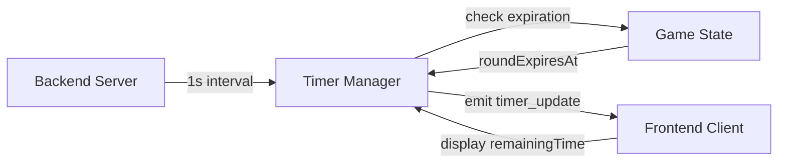

# Round Timer Feature Specification

## 1. Overview

Replace the current 30-second turn timer with a 3-minute round timer that tracks the entire round duration. The timer pauses during AI turns and resumes during human turns (encoder/decoder). If humans fail to guess correctly within 3 minutes, they lose the point and the round ends.

**Key Changes:**
- Replace `HUMAN_TURN_DURATION = 30` with `ROUND_DURATION = 180` (3 minutes)
- Timer resets at the beginning of each round
- Timer pauses during AI turns, resumes during human turns
- Timer expires when humans fail to guess within 3 minutes
- Visual feedback: >2min green, >1min yellow, <1min red, <30s flashing red

## 2. Architecture Diagram



## 3. Configuration

```yaml
game:
  timer:
    roundDuration: 180  # 3 minutes in seconds
    checkInterval: 1000 # 1 second timer check frequency
    visualThresholds:
      green: 120  # >2 minutes
      yellow: 60  # >1 minute  
      red: 60     # <1 minute
      flashing: 30 # <30 seconds flashing red
```

## 4. API / Protocol

### Backend Timer Events

| Event | Payload | Description |
|-------|---------|-------------|
| `timer_update` | `{roomId, remainingTime, currentTurn}` | Emitted every second during human turns |
| `round_end` | `{roomId, correct, score, reason: 'timer_expired'}` | Emitted when round timer expires |

### Game State Changes

| Field | Type | Description |
|-------|------|-------------|
| `roundExpiresAt` | `number?` | Unix timestamp when current round expires |
| `turnExpiresAt` | `number?` | **REMOVED** - replaced by roundExpiresAt |

## 5. Phases & Tasks

### Phase 1: Backend Timer Logic Refactor
- [x] Update `GameStateManager` constants: replace `HUMAN_TURN_DURATION` with `ROUND_DURATION`
- [x] Modify `GameState` interface: replace `turnExpiresAt` with `roundExpiresAt`
- [x] Update `startHumanTurnTimer()` method to `startRoundTimer()` method
- [x] Update `clearTurnTimer()` method to `clearRoundTimer()` method
- [x] Update `isHumanTurnExpired()` method to `isRoundExpired()` method
- [x] Update `getRemainingTime()` method to calculate from `roundExpiresAt`
- [x] Update `handleTimerExpiration()` method for round-based logic
- [x] Update `advanceRound()` method to start new round timer
- [x] Update `advanceTurn()` method to pause/resume round timer based on turn type

### Phase 2: Timer Pause/Resume Logic
- [x] Implement `pauseRoundTimer()` method for AI turns
- [x] Implement `resumeRoundTimer()` method for human turns
- [x] Update `advanceTurn()` to pause timer during AI turns
- [x] Update `advanceTurn()` to resume timer during human turns
- [x] Add timer state tracking (paused/resumed) to GameState
- [x] Update `getRemainingTime()` to account for paused time

### Phase 3: Frontend Timer Display Updates
- [x] Update `AISectionComponent.tsx` timer styling thresholds
- [x] Change green threshold from 20s to 120s (>2 minutes)
- [x] Change yellow threshold from 10s to 60s (>1 minute)
- [x] Change red threshold from 5s to 60s (<1 minute)
- [x] Change flashing threshold from 5s to 30s (<30 seconds)
- [x] Update timer color logic in `getTimerStyle()` function
- [x] Verify timer display shows correct remaining time format

### Phase 4: Timer Expiration Handling
- [x] Update `checkTimerExpiration()` method for round-based expiration
- [x] Ensure round ends immediately when timer expires
- [x] Update round end event emission with timer expiration reason
- [x] Verify AI wins the point when timer expires
- [x] Test round advancement after timer expiration
- [x] Verify new round timer starts correctly

### Phase 5: Integration Testing
- [ ] Test timer starts at beginning of each round
- [ ] Test timer pauses during AI turns
- [ ] Test timer resumes during human turns
- [ ] Test timer expires after 3 minutes of human turn time
- [ ] Test visual feedback changes at correct thresholds
- [ ] Test round advancement after timer expiration
- [ ] Test timer reset for new rounds

### Phase 6: Edge Case Handling
- [ ] Test timer behavior during player disconnection/reconnection
- [ ] Test timer behavior during AI response delays
- [ ] Test timer behavior during network interruptions
- [ ] Verify timer state consistency across multiple clients
- [ ] Test timer behavior during rapid turn transitions

### Phase 7: Performance Optimization
- [ ] Verify 1-second timer check interval is optimal
- [ ] Test timer performance with multiple concurrent games
- [ ] Optimize timer calculation efficiency
- [ ] Verify no memory leaks in timer management

### Phase 8: Documentation & Cleanup
- [ ] Update code comments for new timer logic
- [ ] Remove deprecated turn timer code
- [ ] Update API documentation
- [ ] Update test cases for new timer behavior
- [ ] Verify all existing tests pass with new timer system

## 6. Testing Strategy

### Unit Tests
- [ ] Test `startRoundTimer()` method
- [ ] Test `pauseRoundTimer()` and `resumeRoundTimer()` methods
- [ ] Test `isRoundExpired()` method
- [ ] Test `getRemainingTime()` with paused time
- [ ] Test timer threshold calculations

### Integration Tests
- [ ] Test complete round timer lifecycle
- [ ] Test timer pause/resume during turn transitions
- [ ] Test timer expiration triggers round end
- [ ] Test timer reset for new rounds
- [ ] Test timer behavior with AI responses

### Frontend Tests
- [ ] Test timer display updates correctly
- [ ] Test color changes at correct thresholds
- [ ] Test flashing animation at <30s
- [ ] Test timer display during AI turns (should be paused)

### End-to-End Tests
- [ ] Test complete game flow with round timer
- [ ] Test timer expiration in real game scenario
- [ ] Test multiple rounds with timer reset
- [ ] Test timer behavior with network interruptions

## 7. Monitoring & Metrics

### Timer Performance Metrics
- [ ] Track timer check frequency (should be ~1 second)
- [ ] Monitor timer calculation performance
- [ ] Track timer expiration events
- [ ] Monitor round completion times

### Game Flow Metrics
- [ ] Track average round duration
- [ ] Track timer expiration frequency
- [ ] Monitor turn transition timing
- [ ] Track AI response times

## 8. Deployment

### Backend Deployment
- [ ] Deploy updated GameStateManager with round timer logic
- [ ] Deploy updated GameHandlers with timer pause/resume
- [ ] Verify timer events are emitted correctly
- [ ] Test timer behavior in production environment

### Frontend Deployment
- [ ] Deploy updated timer display components
- [ ] Verify timer styling updates correctly
- [ ] Test timer display across different devices
- [ ] Verify timer behavior with production backend

## 9. Success Criteria

### Functional Requirements
- [ ] Round timer starts at 3 minutes at beginning of each round
- [ ] Timer pauses during AI turns and resumes during human turns
- [ ] Timer expires after 3 minutes of human turn time
- [ ] Round ends immediately when timer expires
- [ ] AI wins the point when timer expires
- [ ] New round timer starts correctly after round advancement

### Visual Requirements
- [ ] Timer displays >2 minutes in green
- [ ] Timer displays >1 minute in yellow
- [ ] Timer displays <1 minute in red
- [ ] Timer flashes red when <30 seconds
- [ ] Timer shows correct remaining time format

### Performance Requirements
- [ ] Timer updates every second without lag
- [ ] Timer calculations complete within 10ms
- [ ] No memory leaks in timer management
- [ ] Timer behavior consistent across multiple clients

### Integration Requirements
- [ ] All existing game functionality preserved
- [ ] Timer works correctly with player disconnection/reconnection
- [ ] Timer behavior consistent with network interruptions
- [ ] All existing tests pass with new timer system
