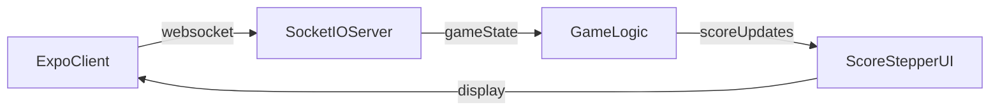

# Score System Update Specification

## 1. Overview

Update the scoring system across the entire application to change from starting at 5 with win conditions at 0 and 10, to starting at 3 with win conditions at 0 and 6. This affects both backend game logic and frontend UI components.

**Current System:**
- Starting score: 5
- Win conditions: 0 (loss) or 10 (win)

**New System:**
- Starting score: 3
- Win conditions: 0 (loss) or 6 (win)

## 2. Architecture Diagram



## 3. Configuration

No configuration changes required - all values will be hardcoded in the application.

## 4. API / Protocol

### Score-Related Events

| Event | Direction | Payload | Description |
|-------|-----------|---------|-------------|
| `gameState` | Server → Client | `{score: number, gameStatus: string}` | Updates client with current score and game status |
| `scoreUpdate` | Server → Client | `{score: number, reason: string}` | Notifies client of score change |
| `gameEnd` | Server → Client | `{winner: string, finalScore: number}` | Announces game end with final score |

### Win Condition Logic

```typescript
// Backend validation
const isGameOver = (score: number): boolean => {
  return score <= 0 || score >= 6;
};

const getWinner = (score: number): string => {
  if (score <= 0) return 'decoder';
  if (score >= 6) return 'encoder';
  return null;
};
```

## 5. Phases & Tasks

### Phase 1: Backend Score System Updates
- [ ] Update game state initialization to start at score 3
- [ ] Modify win condition validation logic (0 and 6 instead of 0 and 10)
- [ ] Update game end detection in game logic
- [ ] Update score calculation and validation functions
- [ ] Modify game state persistence to use new score range
- [ ] Update any score-related constants or enums
- [ ] Ensure all score updates respect new boundaries
- [ ] Update game status determination logic

### Phase 2: Frontend UI Updates
- [ ] Update ScoreStepper component to display 0-6 range instead of 0-10
- [ ] Modify score stepper visual indicators for new range
- [ ] Update any hardcoded score references in UI components
- [ ] Ensure score animations work with new range
- [ ] Update any score-related styling or theming
- [ ] Modify score display formatting if needed
- [ ] Update any score-related tooltips or help text
- [ ] Ensure mobile and web versions are consistent

### Phase 3: Test Updates
- [ ] Update unit tests for game logic with new score values
- [ ] Modify integration tests to use new starting score
- [ ] Update win condition test cases (0 and 6)
- [ ] Revise score progression tests
- [ ] Update UI component tests for new score range
- [ ] Modify end-to-end tests with new scoring system
- [ ] Update performance tests if score-related
- [ ] Ensure all existing test suites pass with new values

### Phase 4: Documentation Updates
- [x] Update any user-facing documentation mentioning scoring
- [x] Modify help text or tooltips about scoring system
- [x] Update README files if they mention scoring
- [x] Revise any API documentation related to scoring
- [x] Update game rules or instructions if documented
- [x] Modify any configuration documentation
- [x] Update developer documentation if score logic is documented
- [x] Ensure mobile and web documentation consistency

## 6. Testing Strategy

### Unit Testing
- Game logic functions with new score boundaries
- Win condition detection (0 and 6)
- Score validation and calculation
- UI component rendering with new range

### Integration Testing
- Full game flow with new scoring system
- Score updates through websocket events
- Game end detection and winner determination
- Score persistence and state management

### End-to-End Testing
- Complete game scenarios with new scoring
- Mobile and web platform consistency
- Score display accuracy across all UI states

## 7. Monitoring & Metrics

### Key Metrics to Monitor
- Game completion rates with new scoring
- Average game duration with shorter score range
- Win/loss distribution changes
- Any errors related to score validation

### Alerts
- Score validation failures
- Game state inconsistencies
- UI rendering errors with new score range

## 8. Deployment

### Deployment Strategy
1. Deploy backend changes first
2. Deploy frontend changes
3. Verify both platforms work with new scoring
4. Monitor for any issues post-deployment

### Rollback Plan
- Revert to previous score values if critical issues arise
- Maintain backward compatibility during transition period

## 9. Success Criteria

### Functional Requirements
- [ ] Games start with score 3 instead of 5
- [ ] Win conditions trigger at 0 and 6 instead of 0 and 10
- [ ] ScoreStepper UI displays 0-6 range correctly
- [ ] All score calculations work with new boundaries
- [ ] Game end detection works with new win conditions
- [ ] Score updates display correctly on both mobile and web

### Quality Requirements
- [ ] All existing unit tests pass with updated values
- [ ] All integration tests pass with new scoring system
- [ ] No regression in game functionality
- [ ] UI remains responsive and visually consistent
- [ ] Score animations work smoothly with new range
- [ ] Documentation accurately reflects new scoring system

### Performance Requirements
- [ ] Score updates maintain same performance characteristics
- [ ] No increase in websocket message size
- [ ] UI rendering performance unchanged
- [ ] Game state persistence works efficiently
